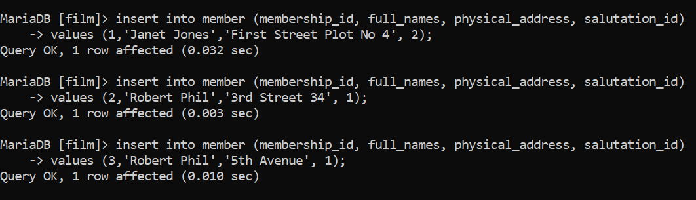
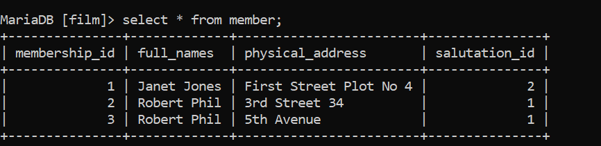
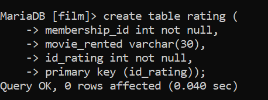
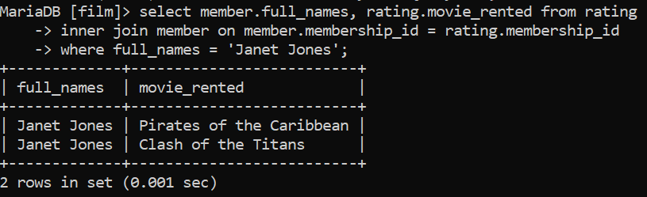

# Tugas 
----- Membuat Database -----

----- Membuat Tabel Member -----

----- Menambahkan Data pada tabel Member -----

----- Menampilkan Semua Tabel Member -----

----- Membuat Tabel Rating -----

----- Menambahkan Data pada tabel Rating -----

----- Menampilkan Semua Tabel Rating -----

----- Perintah SQL untuk menampilkan format tugas -----

