# Latihan 1 (Aktifkan MongoDB Server)
Untuk mengaktifkan mongodb server yaitu sama seperti pertemuan sebelumnya pada pertemuan 2. Apabila sudah menginstall dan sudah pernah menggunakan mongodb sebelumnya, maka hanya perlu membuka command prompt dan masuk ke direktori server bin yakni dengan cara mengetikkan (cd C:\Program Files\MongoDB\Server\4.3\bin) atau bisa dilihat seperti pada gambar dibawah. Kemudian jika sudah di direktori tersebut, ketik mongo dan tekan enter maka akan diproses dan akan menampilkan seperti pada gambar dibawah. Mongodb shell telah diaktifkan.
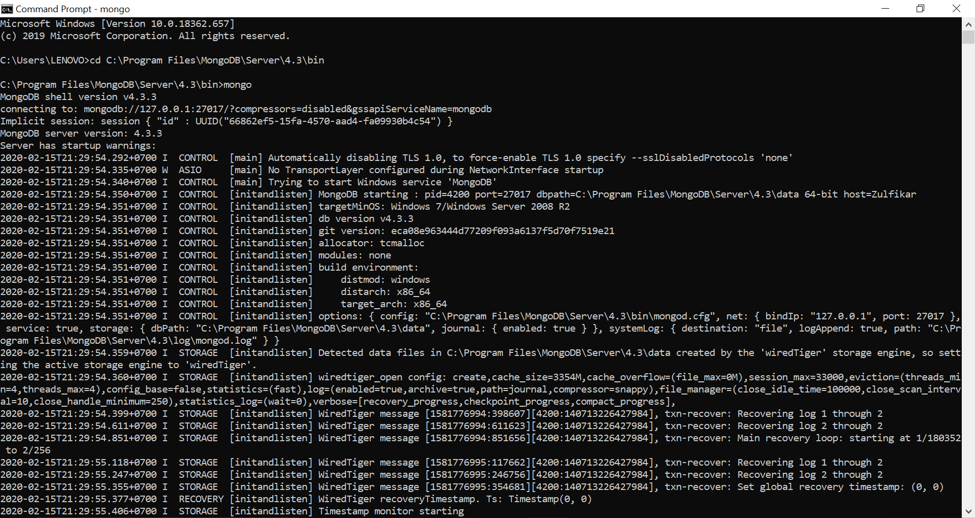
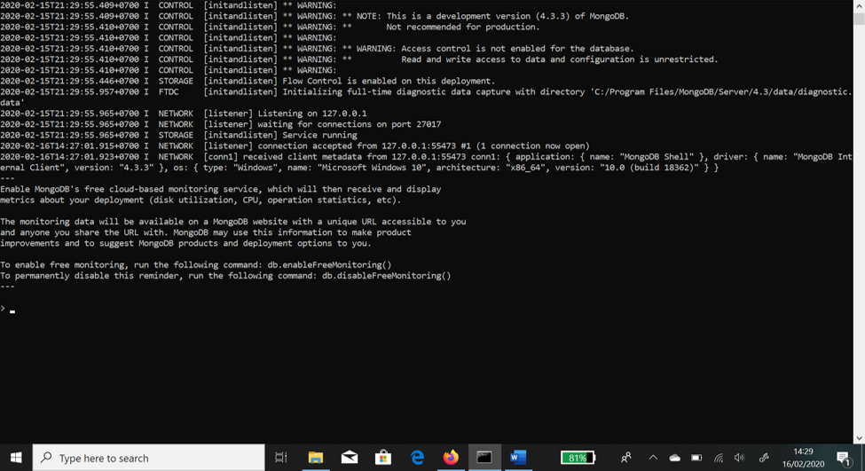

# Latihan 2 (Install Python)
Pada latihan 2 ini yaitu menginstall aplikasi phyton versi 3.8.1. setelah python berhasil didownload, kemudian jalankan file instalasinya. Maka akan menampilkan seperti pada  gambar dibawah. Untuk melanjutkan proses instalasi, pastikan sudah tercentang pada Instal peluncur untuk semua user dan tambahkan python 3.8 untuk path, kemudian klik install now.
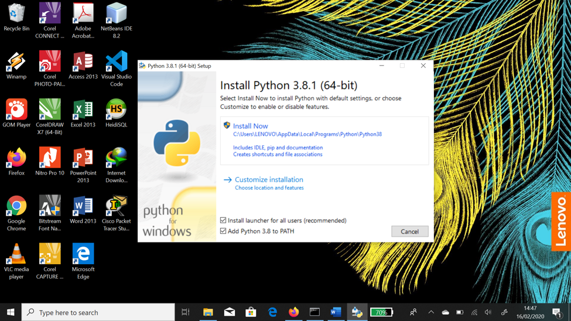
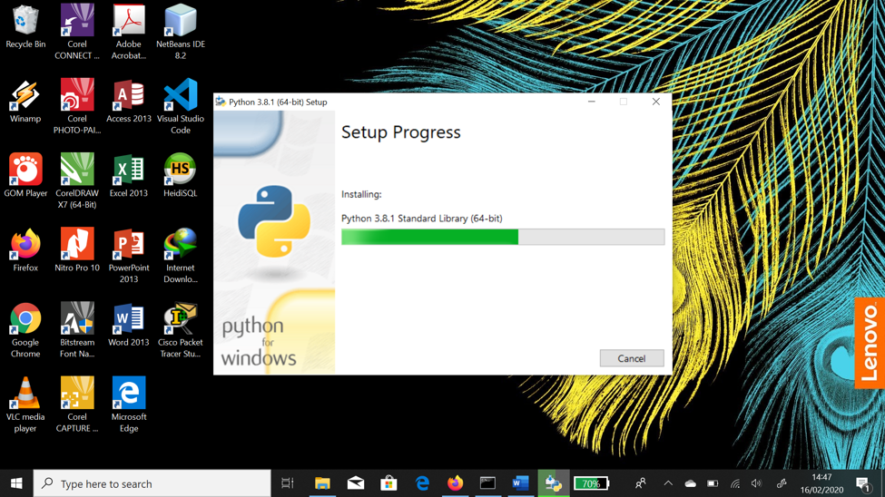

Jika proses selesai, dapat mengaktifkan atau menonaktifkan batasan lintasan direktori Python. Untuk pengguna Linux batasan ini tidak mempunyai pengaruh yang besar, karena Linux menyimpan python pada direktori yang pendek. Berbeda halnya dengan Windows, yang menyimpan direktori lintasan agak jauh dari direktori utama partisi. Disini user menggunakan sistem operasi windows jadi user mengabaikan dan mengklik tombol close. Proses instalasi telah berhasil.
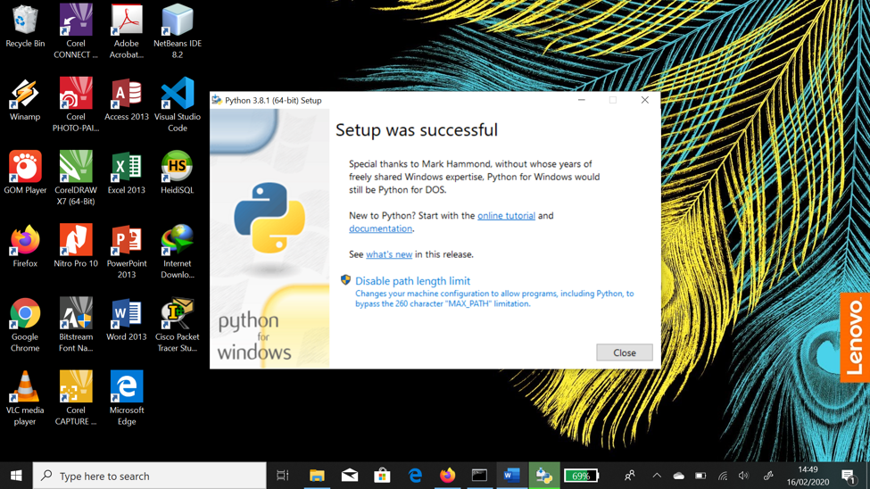
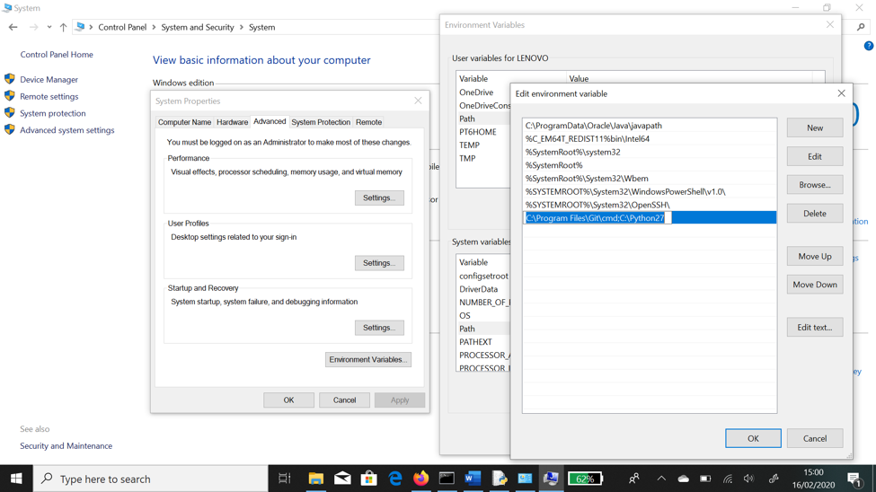

Terdapat beberapa aplikasi yang dapat digunakan
•	Python IDLE Shell ; IDLE adalah kependekan dari Python’s Integrated Development and Learning Environment yang merupakan IDE standar Python.
•	Python 3.6 ; untuk membuka python melalui command prompt.
•	Python 3.6 Manual ; Panduan manual Python.
•	Python Module 3.6 Doc ; Panduan mengenai module pada Python.
Disini user menggunakan IDLE Shell lalu melakukan pengujian dengan mencetak kalimat “hello world”. 
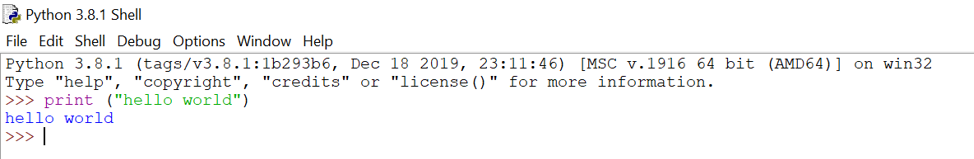

# Latihan 3 (Install Visual Code serta Extention untuk Python)
Sebelumnya user sudah mempunyai aplikasi visual studio code. Disini user hanya tinggal menginstal extension untuk python saja.

# Latihan 4 (Kerjakan Instalasi PyMongo)
Untuk menginstalasi PyMongo, disini user menggunakan pip dimana yang dimaksud dengan pip yaitu penginstal paket untuk Python yang dapat digunakan untuk menginstal paket dari Indeks Paket Python dan indeks lainnya.
Untuk meningkatkan menggunakan pip
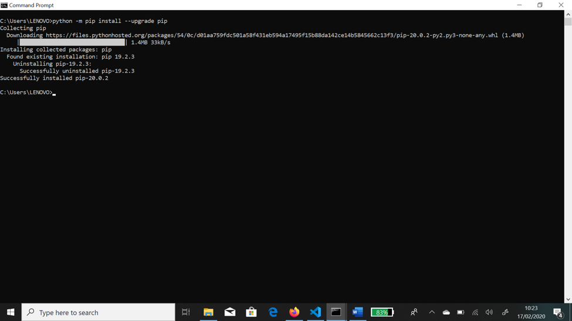

Untuk menginstal pymongo di semua platform
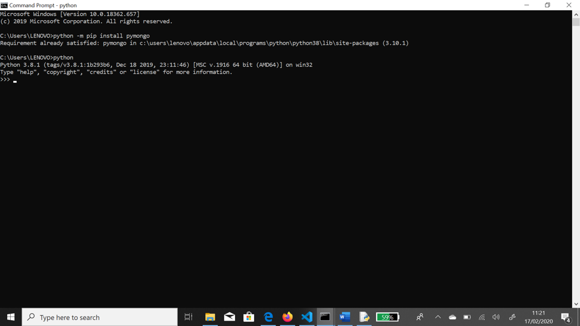

# Latihan 5 (Kerjakan Tutorial Materi dan Penjelasan nomor 4 diatas
Berikut ini beberapa tutorial yang user kerjakan didalam modul pada pertemuan 3. Pertama-tama sebelum mengerjakan tutorial user sudah menginstal dan berada di tampilan command promp pyton. 
Pertama user mengerjakan syarat yaitu import pymongo yang berarti mengambil modul atau function pada python
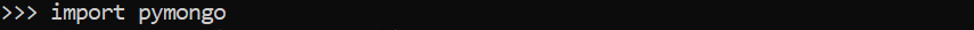

Membuat Koneksi dengan MongoClient
Pada baris pertama yaitu membuat MongoClient ke instance mongod yang sedang berjalan. Kode berikut akan menghubungkan pada host dan port secara default. Dan dibaris kedua yaitu membuat sebuah koneksi ke client yang berisi host dan port default.
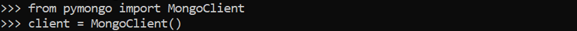

Pada kode dibawah ini akan menentukan host dan port secara eksplisit dengan menggunakan format URL agar menghubungkan ke server database mongoclient.
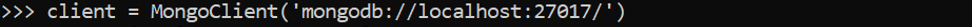

Membuat dan memperoleh basis data dari python
Saat terkoneksi dengan mongodb, agar dapat mengakses database menggunakan atribut pada instance mongoclient akan menampilkan database yang disudah dibuat pada python.
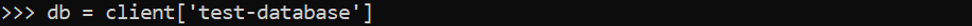

Untuk mengecek keberhasilan dalam membuat database menggunakan python, user menggunakan command prompt mongodb untuk menampilkan database yang dibuat dengan kode show dbs.
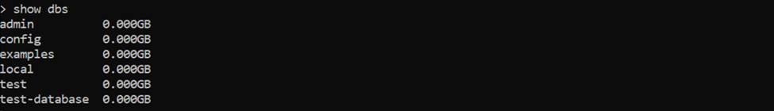

Membuat dan memperoleh collection atau tabel dari python
Collection merupakan dokumen/data yang disimpan dalam database mongodb yang dapat dianggap setara dengan tabel dalam database relasional. Untuk membuat collection di pymongo yaitu dengan kode pada gambar berikut
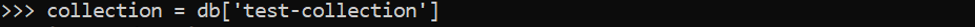

Dokumen
Dokumen dalam monggodb dibawah menggunakan style JSON yang berisi beberapa field yang didalamnya memposting nama, teks, tag dan waktu yang akan diisi pada collection atau tabel post. 
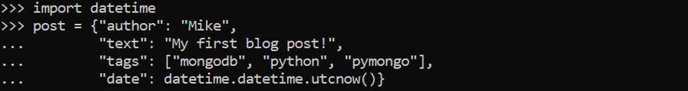

Menyisipkan dokumen
untuk menyisipkan dokumen ke dalam collection, dibaris pertama terdapat collection posts yang berisi data base yang sudah dibuatkan sebelumya. 
Kemudian pada baris kedua dokumen membuat post_id yang berisi metode insert_one dengan collection post. Kemudian, ditambahkan inserted_id dimana secara otomatis ditambahkan jika dokumen tersebut belum mengandung kunci "_id". 
dibaris ketiga user memanggil kembali post_id yang berarti secara otomatis ditambahkan objekId   agar menghasilkan nilai unik objekId yang bertipe heksadesimal.
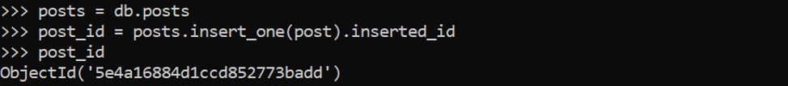

Setelah memasukkan dokumen pertama, koleksi posts sebenarnya telah dibuat di server. user hanya dapat memverifikasi ini dengan men-list semua koleksi yang ada di database
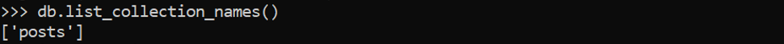

Memperoleh dokumen tunggal menggunakan find_one
Metode ini menampilkan dokumen yang teratas atau paling awal dari collection entry.
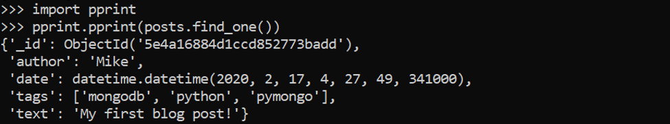

Metode yang kedua yaitu menampilkan dokumen berdasarkan ekspresi dokumen yang dengan penulis “Mike”.
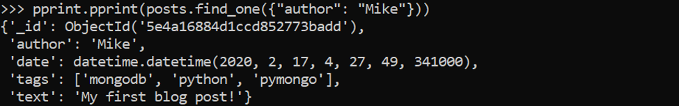

Metode yang ketiga yaitu menampilkan dokumen berdasarkan ekspresi dokumen yang dengan penulis “Eliot”, namun pada didalam collection tidak ada dokumen penulis dengan nama “Eliot”.
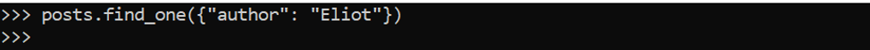

Permintaan dengan ObjekId
Pada baris pertama terdapat post_id yang akan menghasilkan nilai objekId dibaris kedua. Kemudian di baris ketiga yaitu menampilkan dokumen berdasarkan ekspresi dokumen yang sesuai dengan id pada gambar dibawah.
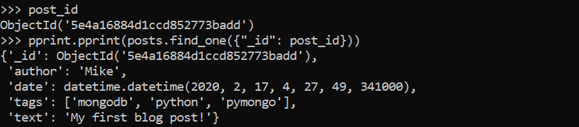

Dibaris kode pertama menjelaskan bahwa merubah nama post_id menjadi string. Kemudian di baris kedua akan menampilkan datanya menjadi string. Namun didalam collection tidak ada dokumen post_id yang sebagai string.
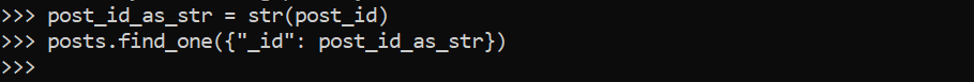

Menginput banyak data
Disini menampilkan kode untuk memasukkan beberapa banyak data. Dimana akan memasukkan setiap dokumen dalam daftar, hanya mengirimkan satu perintah ke server. ada beberapa yang perlu diperhatikan dalam kode dibawah yaitu pada insert_many yang dapat mengembalikan dua atau lebih instance ObjectId untuk setiap dokumen yang dimasukkan. Dan yang kedua yaitu new_posts memiliki bentuk yang berbeda dimana tidak ada field “tags” namun diganti dengan field “title”. Perbedaan inilah yang dimaksud bahwa MongoDB atau noSQL bebas skema.
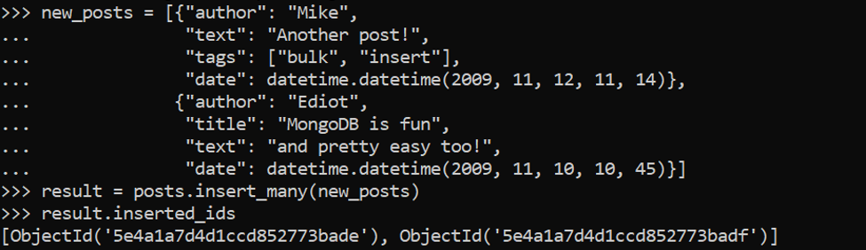

Satu Query untuk lebih dari satu dokumen
Disini akan menampilkan lebih dari satu dokumen yang akan mengulangi setiap dokumen dalam setiap post.
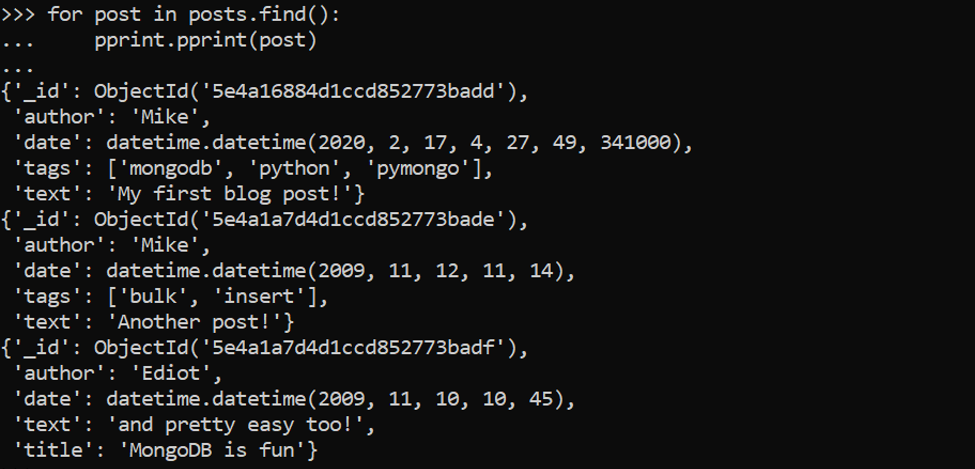

Query yang keduan akan menampilkan dokumen yang berdasarkan field author dengan nama “Mike”.
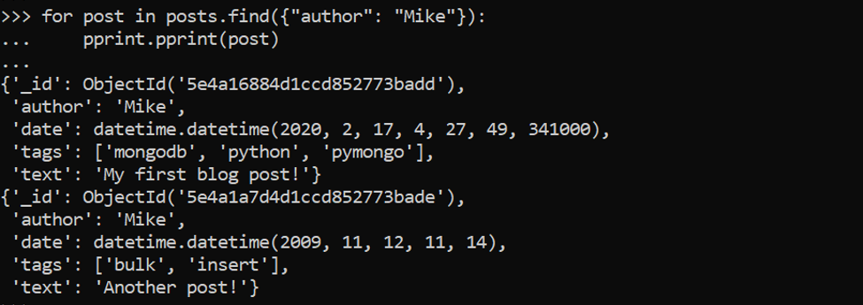

Menghitung
Kode pertama menghitung keseluruhan data dokumen pada colletion posts.
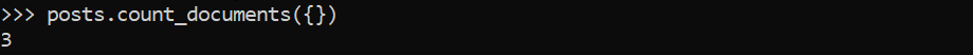

Kode yang kedua menghitung banyak data dokumen pada collection posts dengan permintaan tertentu yaitu dengan field author : “Mike”.
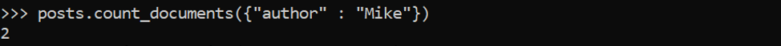

Lebar query
Pada baris pertama terdapat field d yang berisi rentang waktu yang sudah ditentukan dan di kode baris kedua perintah untuk menampilkan dokumen dengan rentang waktu kurang dari rank yang ada di field d yang di sortir berdasarkan author.
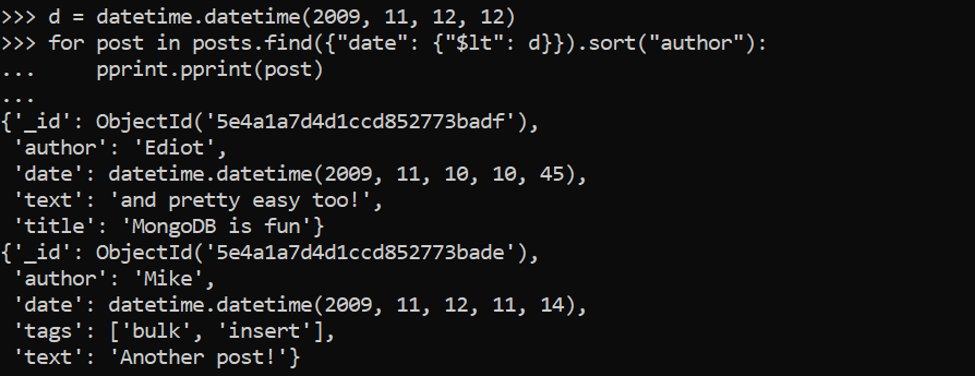

Index
Disini akan membuat index pada collection profiles yang akan diurutkan nilai user_id secara terkecil ke terbesar (ascending) dan dengan id yang unik.
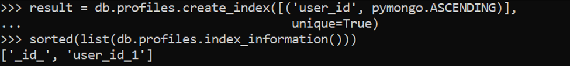

Kemudian kode pada gambar dibawah mengatur beberapa dokumen pada field user_profiles.
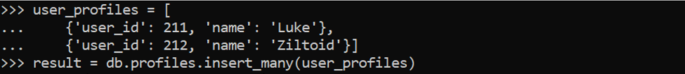