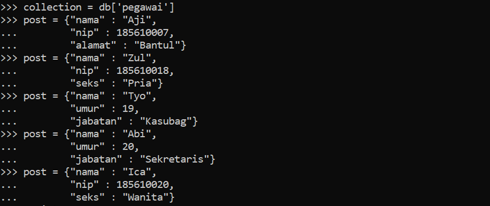
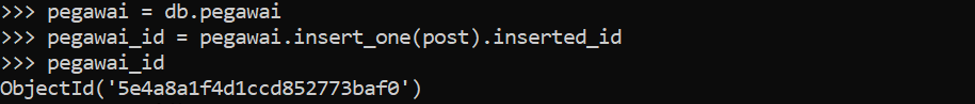
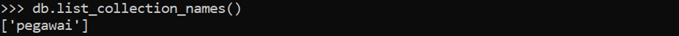
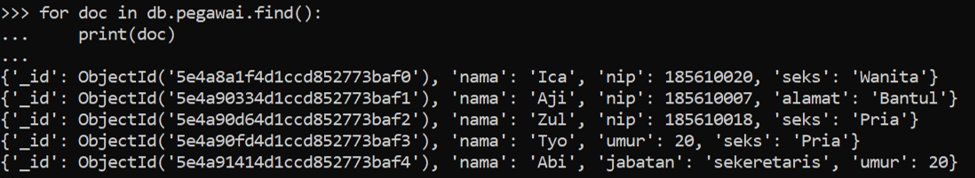
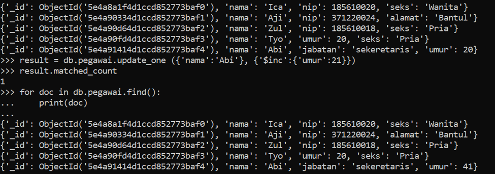
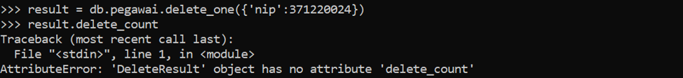
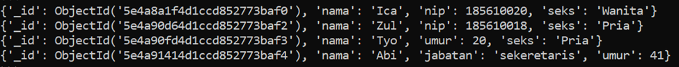

# Tugas
Cari berbagai data semi / tidak terstruktur - minimal 5, kerjakan operasi CRUD untuk data tersebut di MongoDB menggunakan Python

CREATE - MEMBUAT DATABASE

CREATE – MEMBUAT COLLECTION

CREATE - MEMBUAT DOKUMEN

CREATE – MENGINSERT DOKUMEN

READ - MENAMPILKAN SATU DATA DOKUMEN PADA COLLECTION PEGAWAI 

UPDATE – MENGUBAH DATA UMUR PADA DOKUMEN DENGAN NAMA ABI

DELETE – MENGHAPUS DOKUMEN DENGAN NIP 371220024

