Pada pertemuan 4, user menggunakan software sistem operasi linux dan tidak perlu memerlukan aplikasi docker.

# Latihan 1 (Jalankan Redis server menggunakan Docker)
Pada latihan 1 akan menjelaskan installasi redis pada linux menggunakan terminal. Disini user tidak menggunakan docker karena docker sudah berada pada repositori linux sehingga docker tidak harus diinstal pada sistem operasi linux.

Untuk melakukan proses instalasi redis menggunakan terminal pada linux ubuntu. Pertama-tama pastikan PC sudah terhubung dengan koneksi internet dan menjalankan terminal. Kemudian user menginput apt update untuk meng-update sistem agar lebih aman dan luwes untuk menginstall redis.

Sebelum itu user sudah masuk ke dalam mode hak akses root dimana agar dapat mengubah atau memperbaharui sistem pada linux.
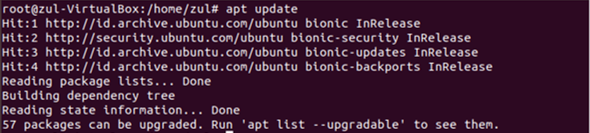

Selanjutnya untuk menguji koneksi apakah terhubung dengan koneksi internet, user mencoba ping ke alamat IP server google. IP yang digunakan yaitu 8.8.8.8. hasil yang diperoleh yakni terhubung.
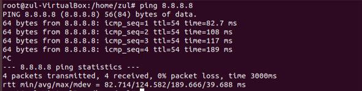

Untuk melakukan instalasi redis dalam terminal, user menginput apt install redis redis-server redis-tools dimana redis akan diinstal dalam terminal tersebut.
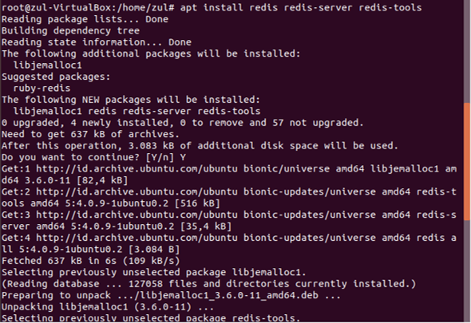

Untuk membersihkan file sampah setelah menginstall redis. User menginput apt-cache search redis yang tujuannya untuk menghapus file yang sudah tidak digunakan pada redis.
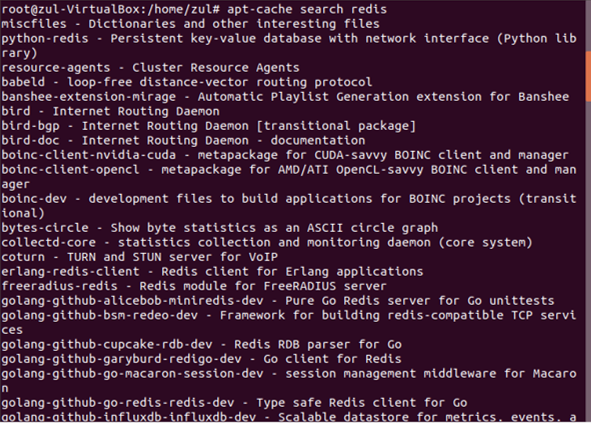

Untuk mengakses redis, langkah pertama user berpindah ke direktori yang dimana redis terinstall, kemudian menghubungkan koneksi dengan menginput redis-cli.
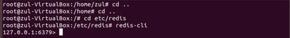

# Latihan 2 (Dengan menggunakan Docker, koneksikan redis-cli ke server redis yang anda jalankan pada langkah pertama)
Pada latihan 2 tidak harus mengkoneksikan redis-cli dengan server redis, karena pada terminal linux sudah masuk dalam redis itu sendiri dan melakukan penghubungan.

# Latihan 3 (Kerjakan Materi dan Penjelasan nomor 4, khusus untuk cli commands serta data types)

- STRING -
set : Mengentry data pada key
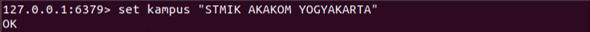

get : Menampilkan data pada key
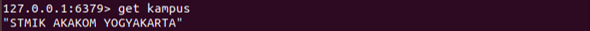

strlen : Menampilkan jumlah lebar data pada key
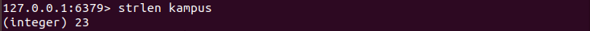

getrange : Menampilkan data sesuai pada titik poin tertentu
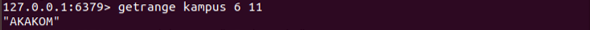

append : Menggabungkan data pada key
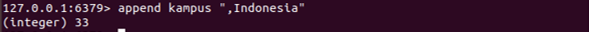

bitcount : Hitung jumlah bit yang ditetapkan (penghitungan populasi) dalam sebuah string.
Secara default semua byte yang terkandung dalam string diperiksa. Dimungkinkan untuk menentukan operasi penghitungan hanya dalam interval yang melewati argumen tambahan mulai dan berakhir .
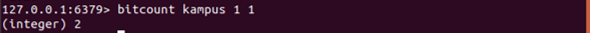

setnx : Tetapkan key untuk menyimpan value string jika key tidak ada. Dalam hal ini, itu sama dengan SET . Ketika key sudah memiliki nilai, tidak ada operasi yang dilakukan. SETNX adalah kependekan dari " SET if N ot e X ists".
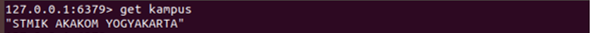
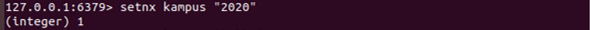
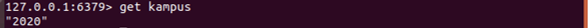

setrange : Menambahkan data pada key sesuai dengan titik awal bit hingga akhir bit
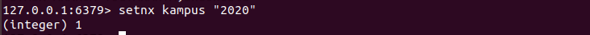

mset : Atur kunci yang diberikan ke nilai masing-masing. MSET mengganti nilai yang ada dengan nilai baru, seperti SET biasa.
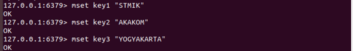

mget : Mengembalikan nilai semua kunci yang ditentukan. Untuk setiap kunci yang tidak memiliki nilai string atau tidak ada, nilai khusus nil dikembalikan. Karena itu, operasi tidak pernah gagal.
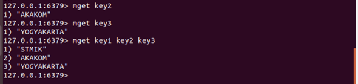

incr : Menambahkan jumlah yang disimpan pada key per satu
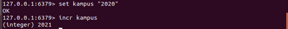

incby : Menambah jumlah yang disimpan pada key dengan increment.
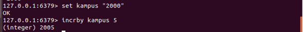

incbyfloat : Menambahkan string yang mewakili nomor floating point yang disimpan pada key dengan increment ditentukan. Dengan menggunakan nilai increment negatif, hasilnya adalah bahwa nilai yang disimpan di kunci dikurangi (oleh properti tambahan yang jelas).
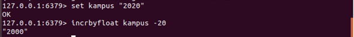

decrby : Mengurangi jumlah yang disimpan pada key dengan decrement
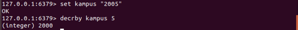

del : Menghapus data pada key
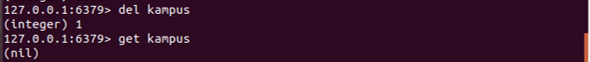

- LISTS -
rpushx : Menyisipkan nilai yang ditentukan di bagian atas daftar yang disimpan di key, hanya jika key sudah ada dan menyimpan daftar. Berbeda dengan LPUSH, tidak ada operasi akan dilakukan ketika key belum ada.
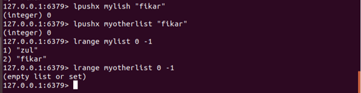

rpush : Masukkan semua nilai yang ditentukan di bagian belakang daftar yang disimpan di key. Jika tidak ada key, itu dibuat sebagai daftar kosong sebelum melakukan operasi push. Ketika key menyimpan nilai yang bukan daftar, kesalahan dikembalikan.
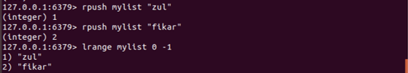

lpush : Masukkan semua nilai yang ditentukan di bagian belakang daftar yang disimpan di key. Jika tidak ada key, itu dibuat sebagai daftar kosong sebelum melakukan operasi push. Ketika key menyimpan nilai yang bukan daftar, kesalahan dikembalikan.
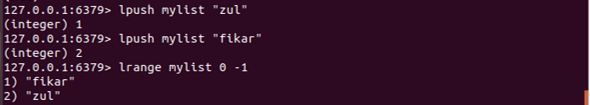

lindex : Mengembalikan elemen pada indeks index dalam daftar yang disimpan di key. Indeks ini berbasis nol, jadi 0 berarti elemen pertama, 1 elemen kedua dan seterusnya. Indeks negatif dapat digunakan untuk menunjuk elemen mulai dari ujung daftar. Di sini, -1 berarti elemen terakhir, -2 berarti kedua dari belakang dan sebagainya.
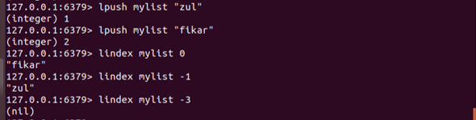

Linsert : Sisipan element dalam daftar yang disimpan di key sebelum atau setelah pivot nilai referensi.
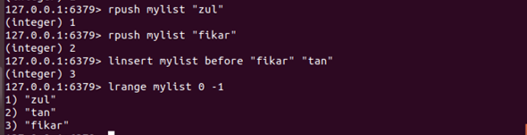

llen ; Mengembalikan panjang daftar yang disimpan di key. Jika key tidak ada, itu ditafsirkan sebagai daftar kosong dan 0 dikembalikan.
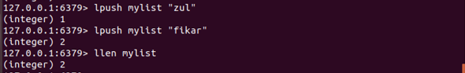

Lpop : Menghapus dan mengembalikan elemen pertama dari daftar yang disimpan di key.
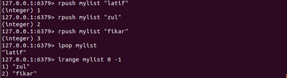

lset : Setel elemen daftar di index ke element
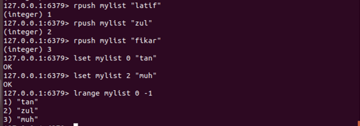

ltrim : Pangkas daftar yang sudah ada sehingga hanya akan berisi rentang elemen tertentu yang ditentukan. Baik start dan stop adalah indeks berbasis nol, di mana 0 adalah elemen pertama dari daftar (kepala), 1 elemen berikutnya dan seterusnya.
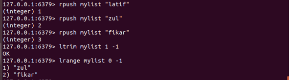

rpop : Menghapus dan mengembalikan elemen terakhir dari daftar yang disimpan di key.
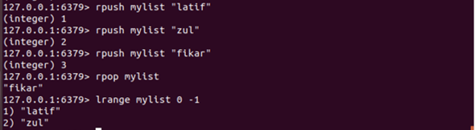

rpoplpush : mengembalikan dan menghapus elemen terakhir (ekor) dari daftar yang disimpan di source, dan mendorong elemen di elemen pertama (kepala) dari daftar yang disimpan di destination.
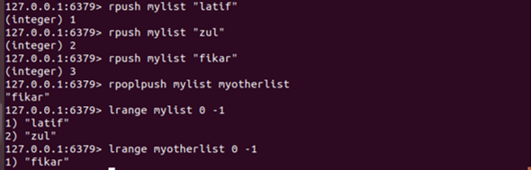

- SETS - 
sadd : Tambahkan anggota yang ditentukan ke set yang disimpan di key. Anggota tertentu yang sudah menjadi anggota set ini diabaikan.
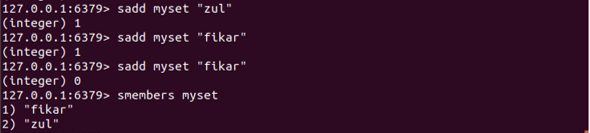

scard : Mengembalikan kardinalitas set (jumlah elemen) dari set yang disimpan di key.
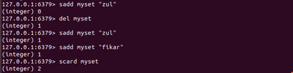

srem : Hapus anggota yang ditentukan dari set yang disimpan di key.
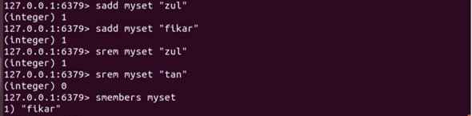

sismember : Kembali jika member adalah anggota dari set yang disimpan di key.
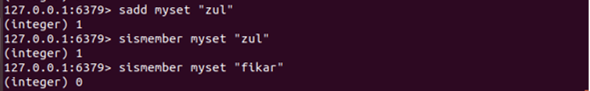

smembers : Mengembalikan semua anggota dari nilai yang disetel yang disimpan pada key.
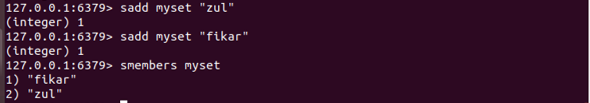

sunion : Mengembalikan anggota set yang dihasilkan dari penyatuan semua set yang diberikan.
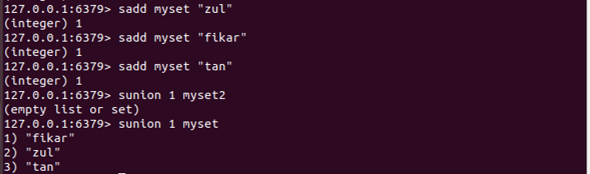

smove : Pindahkan member dari set at source ke set at destination. Operasi ini adalah atom. Pada setiap momen tertentu elemen tersebut akan muncul sebagai anggota source atau destination untuk klien lain.
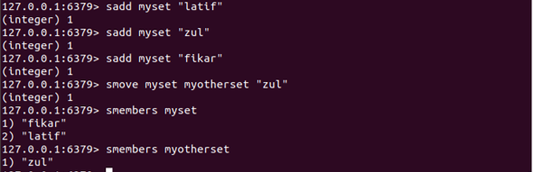

spop : Menghapus dan mengembalikan satu atau beberapa elemen acak dari penyimpanan nilai yang ditetapkan pada key.
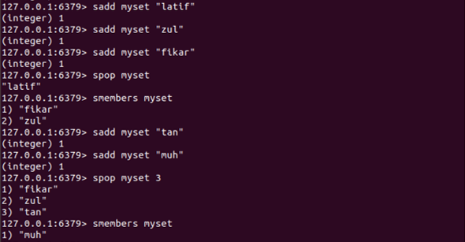

- SORTED SETS -
zadd : Menambahkan semua anggota yang ditentukan dengan skor yang ditentukan ke set diurutkan yang disimpan di key . Dimungkinkan untuk menentukan beberapa skor/pasangan anggota.
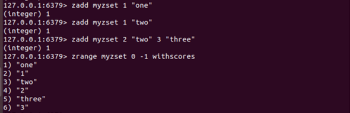

zcount : Mengembalikan jumlah elemen dalam set key diurutkan dengan skor antara min dan max.
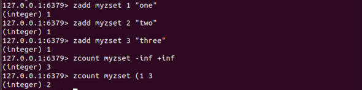

zicrby : Menambah skor member dalam set yang diurutkan yang disimpan pada key dengan increment. Jika member tidak ada di set diurutkan, itu ditambahkan dengan increment sebagai skornya (seolah-olah skor sebelumnya adalah 0.0 ).
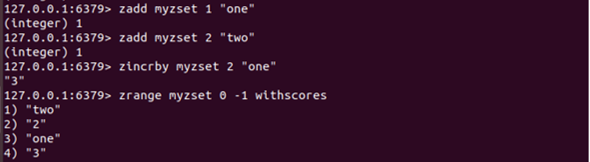

zrange : Mengembalikan rentang elemen yang ditentukan dalam set diurutkan yang disimpan di key. Elemen-elemen dianggap dipesan dari skor terendah ke tertinggi. Urutan leksikografis digunakan untuk elemen dengan skor yang sama.
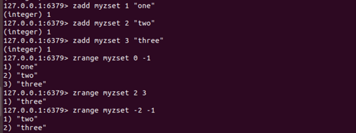
Contoh berikut menggunakan WITHSCORES menunjukkan bagaimana perintah mengembalikan selalu array, tetapi kali ini, diisi dengan element_1, score_1 , element_2 , score_2 , ..., element_N , score_N.
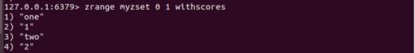

zrank : Mengembalikan pangkat member dalam set yang disortir disimpan di key, dengan skor dipesan dari rendah ke tinggi. Peringkat (atau indeks) adalah berbasis 0, yang berarti bahwa anggota dengan skor terendah memiliki peringkat 0.
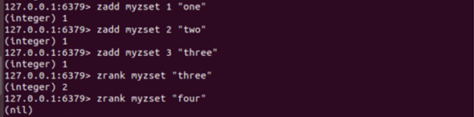

zrem : Menghapus anggota yang ditentukan dari set diurutkan yang disimpan di key. Anggota yang tidak ada diabaikan.
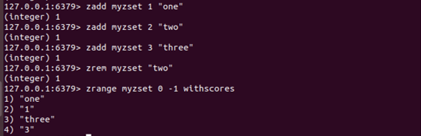

zremrangebyrank : Menghapus semua elemen dalam set yang diurutkan yang disimpan pada key dengan peringkat antara start dan stop. Baik start dan stop adalah indeks berbasis 0 dengan 0 sebagai elemen dengan skor terendah.
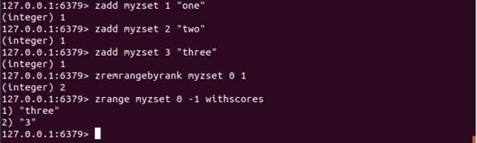

zremrangebyscore : Mengembalikan semua elemen dalam set yang diurutkan pada key dengan skor antara max dan min (termasuk elemen dengan skor sama dengan max atau min ). Berbeda dengan pemesanan default dari set yang diurutkan, untuk perintah ini elemen dianggap dipesan dari skor tinggi ke rendah.
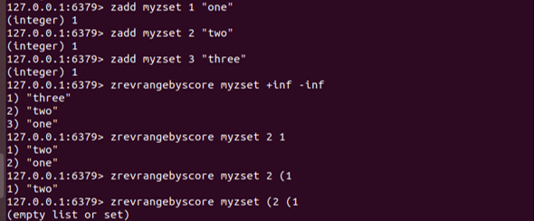

zscore : Mengembalikan skor member dalam key diurutkan.

zrangebyscore : Mengembalikan semua elemen dalam set yang diurutkan pada key dengan skor antara min dan max (termasuk elemen dengan skor sama dengan min atau max ). Elemen-elemen dianggap dipesan dari skor rendah ke tinggi.

- HASHES -
hget : Mengembalikan nilai yang terkait dengan field dalam hash yang disimpan di key.

hgetall : Mengembalikan semua bidang dan nilai hash yang disimpan di key. Dalam nilai yang dikembalikan, setiap nama bidang diikuti oleh nilainya, sehingga panjang balasannya dua kali ukuran hash.

hset : Setel field dalam hash yang disimpan pada key ke value. Jika key tidak ada, kunci baru yang menahan hash dibuat. Jika field sudah ada di hash, itu ditimpa.

hsetnx : Setel field dalam hash yang disimpan pada value key, hanya jika field tersebut belum ada. Jika key tidak ada, kunci baru yang menahan hash dibuat. Jika field sudah ada, operasi ini tidak berpengaruh.

hincrby : Menambah jumlah yang disimpan di field dalam hash yang disimpan di key dengan increment.

hdel : Menghapus bidang yang ditentukan dari hash yang disimpan di key.

hexists : Kembali jika field adalah field yang ada di hash yang disimpan di key.

hkeys : Mengembalikan semua nama bidang dalam hash yang disimpan di key.

hlen : Mengembalikan jumlah bidang yang terkandung dalam hash yang disimpan di key.

hstrlen : Mengembalikan panjang string dari nilai yang terkait dengan field dalam hash yang disimpan di key.

hvals : Mengembalikan semua nilai dalam hash yang disimpan di key.

- HYPERLOGLOG -
pfadd : Menambahkan semua argumen elemen ke struktur data HyperLogLog yang disimpan di nama variabel yang ditentukan sebagai argumen pertama.

pfcount : Ketika dipanggil dengan kunci tunggal, mengembalikan kardinalitas yang diperkirakan dihitung oleh struktur data HyperLogLog yang disimpan pada variabel yang ditentukan, yaitu 0 jika variabel tidak ada.

pfmerge : Gabungkan beberapa nilai HyperLogLog menjadi nilai unik yang akan mendekati kardinalitas penyatuan Kumpulan yang diamati dari struktur HyperLogLog sumber. HyperLogLog gabungan yang dihitung ditetapkan ke variabel tujuan, yang dibuat jika tidak ada (default ke HyperLogLog kosong).
