# Tugas (Kerjakan [Redis Quick Guide](https://www.tutorialspoint.com/redis/redis_quick_guide.htm), untuk bagian instalasi serta redis cli, gunakan Docker.)

Pada pertemuan 4, user menggunakan software sistem operasi linux dan tidak perlu memerlukan aplikasi docker.

1.	Untuk menjalankan perintah di server Redis, Anda memerlukan klien Redis. Klien Redis tersedia dalam paket Redis, yang telah user instal sebelumnya pada latihan.
Untuk memulai klien Redis, buka terminal dan ketik perintah redis-cli. Ini akan terhubung ke server lokal Anda dan sekarang Anda dapat menjalankan perintah apa pun.

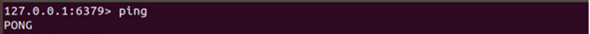

Pada contoh di atas, kita terhubung ke server Redis yang berjalan di mesin lokal dan menjalankan perintah PING, yang memeriksa apakah server berjalan atau tidak.

2.	Perintah key Redis digunakan untuk mengelola key di Redis. Berikut ini adalah sintaks untuk menggunakan perintah key redis.

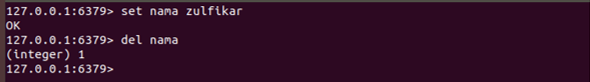

Dalam contoh di atas, DEL adalah perintah, sedangkan nama adalah key-nya. Jika key dihapus, maka output dari perintah akan menjadi (integer) 1, jika tidak maka akan menjadi (integer) 0.

3.	Perintah string Redis digunakan untuk mengelola nilai string di Redis. Berikut ini adalah sintaks untuk menggunakan perintah string Redis.

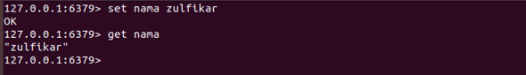

Dalam contoh di atas, SET Perintah ini menetapkan nilai pada key yang ditentukan. dan GET adalah perintah mendapat nilai key, sedangkan nama adalah kuncinya.

4.	Redis Hash adalah peta antara bidang string dan nilai-nilai string. Oleh karena itu, mereka adalah tipe data yang sempurna untuk mewakili objek.
Di Redis, setiap hash dapat menyimpan hingga lebih dari 4 miliar pasangan nilai bidang.

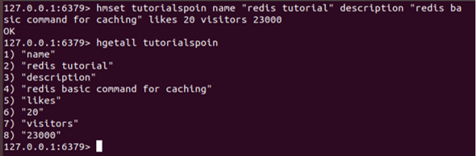

Dalam contoh di atas, kami telah menetapkan detail tutorial Redis (nama, description, likes, visitors) dalam hash bernama 'tutorialspoin'.

5.	List Redis hanyalah list string, diurutkan berdasarkan urutan penyisipan. Anda dapat menambahkan elemen dalam list Redis di bagian atas atau bawah list.
Panjang maksimum list adalah 2 32 - 1 elemen (4294967295, lebih dari 4 miliar elemen per list).

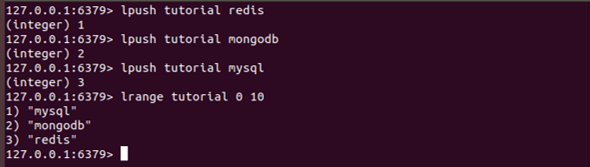

Dalam contoh di atas, tiga nilai dimasukkan dalam list Redis bernama 'tutorial' oleh perintah LPUSH.

6.	Redis Sets adalah koleksi string unik yang tidak disusun. Unik berarti set tidak memungkinkan pengulangan data dalam kunci.
Dalam set Redis menambah, menghapus, dan menguji keberadaan anggota di O (1) (waktu konstan terlepas dari jumlah elemen yang terkandung di dalam Set). Panjang maksimum daftar adalah 2 32 - 1 elemen (4294967295, lebih dari 4 miliar elemen per set).

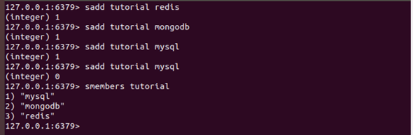

Pada contoh di atas, tiga nilai dimasukkan dalam set Redis bernama 'tutorial' oleh perintah SADD.

7.	Redis Sorted Sets mirip dengan Redis Sets dengan fitur unik nilai yang disimpan dalam satu set. Perbedaannya adalah, setiap anggota Set Diurutkan dikaitkan dengan skor, yang digunakan untuk mengambil set diurutkan yang dipesan, dari yang terkecil hingga skor terbesar.
Di Redis set yang diurutkan, tambahkan, hapus, dan uji keberadaan anggota di O (1) (waktu konstan terlepas dari jumlah elemen yang terkandung di dalam set). Panjang maksimum daftar adalah 2 32 - 1 elemen (4294967295, lebih dari 4 miliar elemen per set).

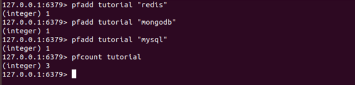

Dalam contoh di atas, tiga nilai dimasukkan dengan skornya di set Redis yang diurutkan bernama 'tutorials' oleh perintah ZADD.

8.	Redis HyperLogLog adalah algoritma yang menggunakan pengacakan untuk memberikan perkiraan jumlah elemen unik dalam satu set menggunakan hanya konstan, dan sejumlah kecil memori.

9.	Redis Pub / Sub mengimplementasikan sistem pesan di mana pengirim (dalam terminologi redis disebut penerbit) mengirim pesan sementara penerima (pelanggan) menerimanya. Tautan yang digunakan untuk mentransfer pesan disebut saluran .Di Redis, klien dapat berlangganan sejumlah saluran.
Contoh berikut menjelaskan cara mempublikasikan konsep pelanggan. Dalam contoh berikut, satu klien berlangganan saluran bernama 'redisChat'.

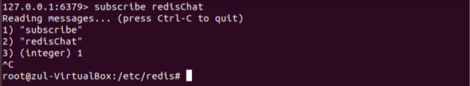

10.	Transaksi redis memungkinkan eksekusi sekelompok perintah dalam satu langkah. Berikut ini adalah dua sifat Transaksi.
-	Semua perintah dalam transaksi dieksekusi secara berurutan sebagai operasi tunggal yang terisolasi. Tidak mungkin bahwa permintaan yang dikeluarkan oleh klien lain dilayani di tengah pelaksanaan transaksi Redis.
-	Transaksi redis juga bersifat atomik. Atomic berarti semua perintah atau tidak ada yang diproses.
Transaksi redis dimulai oleh perintah MULTI dan kemudian Anda harus memberikan daftar perintah yang harus dijalankan dalam transaksi, setelah itu seluruh transaksi dieksekusi oleh perintah EXEC .

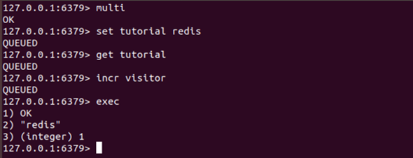

11.	Redis scripting digunakan untuk mengevaluasi skrip menggunakan Lua interpreter. Itu dibangun ke Redis mulai dari versi 2.6.0. Perintah yang digunakan untuk skrip adalah perintah EVAL.

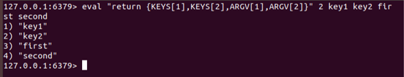

12.	Perintah koneksi Redis pada dasarnya digunakan untuk mengelola koneksi klien dengan server Redis.

13.	Perintah server Redis pada dasarnya digunakan untuk mengelola server Redis.

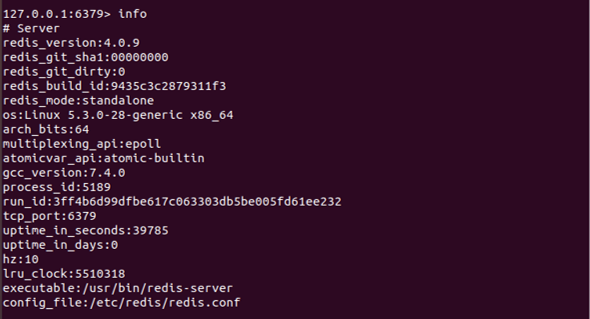
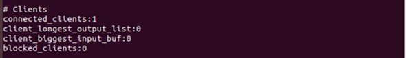
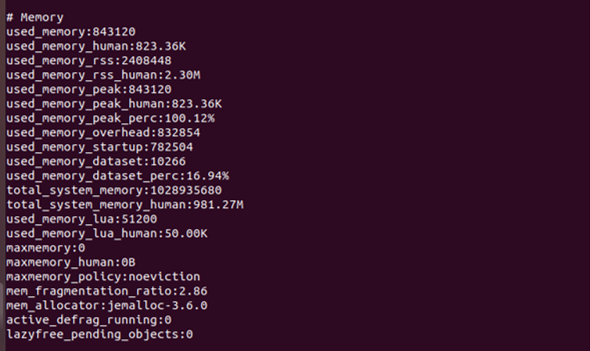
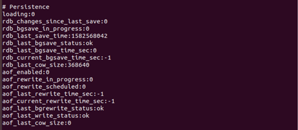
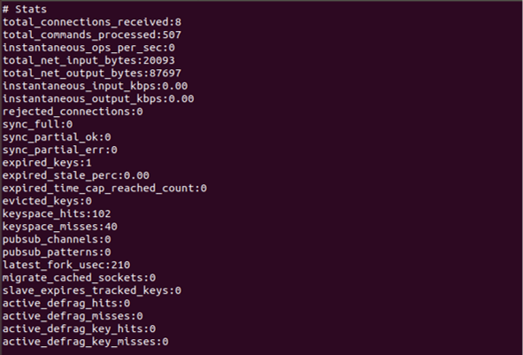
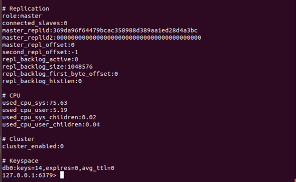
