Pada pertemuan 5, user menggunakan software sistem operasi linux.

# Latihan 1 (Hidupkan server Redis)
Pertama tama disini user membuat satu direktori dengan nama redis-demo kemudian user masuk atau mengakses direktori yang sudah dibuat. Lalu, user menginstal python dengan source codenya sudo apt install python-pip.

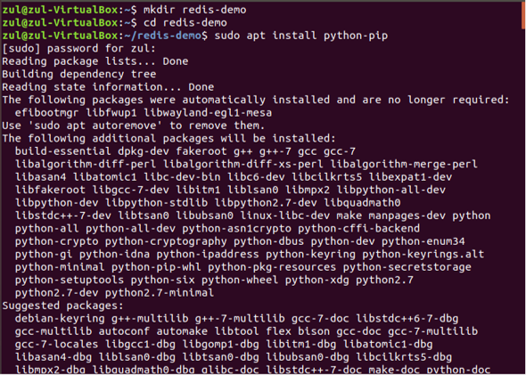

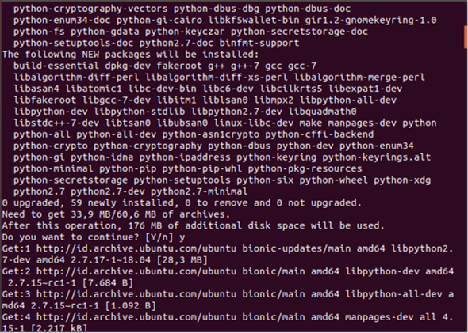

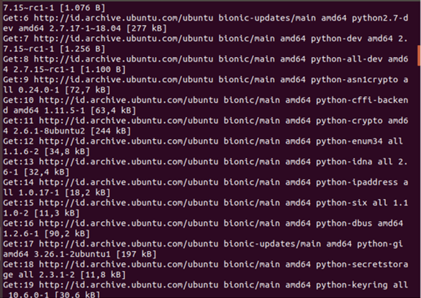

Selanjutnya untuk memulai redis-cli pada beberapa shell, yang mana dapat menghubungkan kembali perintah Python redis dan perintah redis biasa dengan menginstall redis-py.

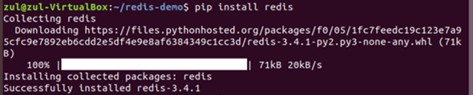

Untuk mengatahui apakah python dengan redis sudah terhubung, maka user membuat satu dokumen dengan nama connect.py yang disimpan dalam directory redis-demo.

Didalam dokumen connect.py user menginputkan query seperti  pada gambar dibawah agar saat mengecek koneksi antara redis dan pyton dan terhubung maka akan menampilkan “Connection to redis jas beend established” jika tidak terhubung maka akan menampilkan “Cannot connection to redis”.

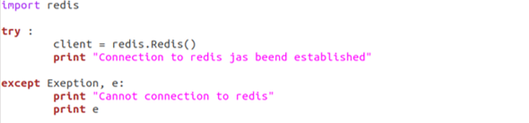

Dibawah ini user mencoba mengecek koneksi antara redis dan pyton. Hasil output menampilkan “Connection to redis jas beend established” maka artinya keduanya sudah terhubung. Kemudian user mengakses dan masuk pada python, python siap dijalankan.

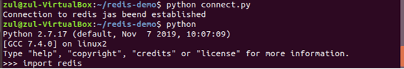

Pada pertemuan sebelumnya user sudah menjelaskan dan melakukan penginstalan redis pada terminal linux, disini user langsung mengakses dan masuk pada redis pada terminal. Redis siap dijalankan.

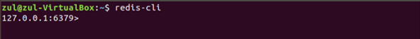

# Latihan 2 (Kerjakan Materi dan Penjelasan 2, 3 dan 4)

-- Materi dan Penjelasan 2

STRING
Pada redis berikut ini untuk mengatur nilai string, user menggunakan yang berikut dari redis-cli.

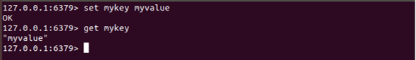

Sekarang user ingin melakukan hal yang sama pada shell Python dimana membuat instance dari StrictRedis . Ini diperlukan untuk komunikasi dengan redis-server. Coba dapatkan "mykey", yang diset menggunakan redis-cli dari Python. Output menampilkan hasil yang sama pada redis dimana python dapat berkomunikasi dengan benar dengan redis-server. Hal-hal yang dimasukkan ke dalam redis menggunakan redis-cli dapat dibaca menggunakan Python.

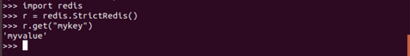

Selanjutnya user mencoba mengatur nilai ke Redis dari Python shell.

Kemudian periksa dari redis-cli apakah kunci ini disetel dengan benar. 

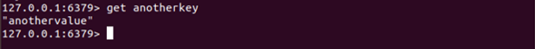

Seperti pada hasil tampilan output pada gambar terminal dimana python dapat memasukkan nilai ke dalam Redis dengan benar. 

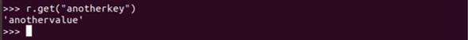

INCR dan INCRBY
Redis juga menyediakan incr dan incrby pada nilai integer. Disini user akan mencoba menetapkan nilai integer.

setara redis-py dari Redis 'incr adalah 

Menampilkan untuk memverifikasi bahwa num telah bertambah

User memastikan dengan mengecek menggunakan redis-cli juga.

Setara Python dengan incrby adalah

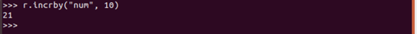

User memastikan dengan mengecek lagi menggunakan redis-cli juga.
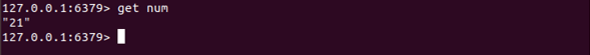

EXISTS

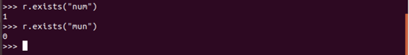

DEL
Saat kunci ini dihapus pada python, maka kita akan mendapatkan "nihil" dan "Tidak Ada" jika Anda mencoba mengambilnya pada redis.

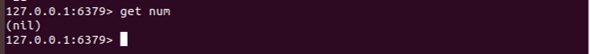

EXPIRE
Tandai key second_num untuk kedaluwarsa setelah 10 detik

Kemudian user memeriksa lagi setelah 10 detik, hasil yang ditampilkan yaitu kosong atau tidak menampilkan output dimana second_num sudah kadaluarsa

REDIS LISTS
Redis lpush setara dengan menggunakan Python

User memastikan dengan mengecek dan verifikasi bahwa list dibuat diredis.

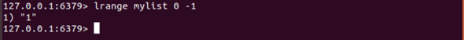

Menambahkan beberapa nilai ke list

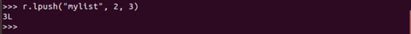

Periksa daftar baru dari redis-cli

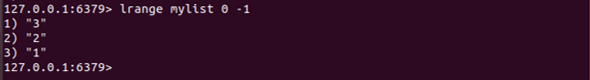

Periksa daftar baru dari Python

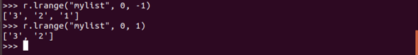

rpush

Periksa elemen yang didorong ke kanan

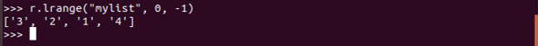

REDIS HASHES
hmset memungkinkan penyimpanan kamus sebagai nilai. Ini sama seperti pada redis docs.

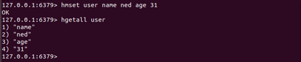

redis-py cara mencapai hal yang sama akan

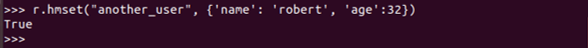

Memastikan yang diinput pada python ini menggunakan redis-cli

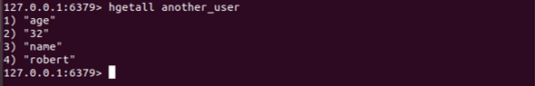

Menampilkan ini menggunakan redis-py

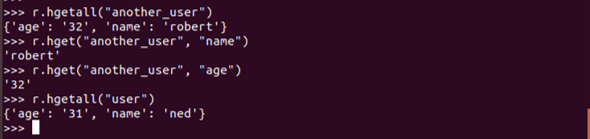

-- Materi dan Penjelasan 3

-- Materi dan Penjelasan 4
Pada materi dan penjelasan dibagian 3 yaitu menulis program dengan python yang membutuhkan lima langkah dasar yaitu impor redis, tentukan informasi koneksi untuk redis, membuat objek koneksi redis, mengatur pesan ke redis, mengambil pesan redis dan menampilkan pesan tersebut. 
Pertama – tama pada shell unix python, disini user membuat dokumen baru dengan nama python3.py yang didalamnya akan berisi skrip untuk mengimplementasikan 5 langkah tersebut

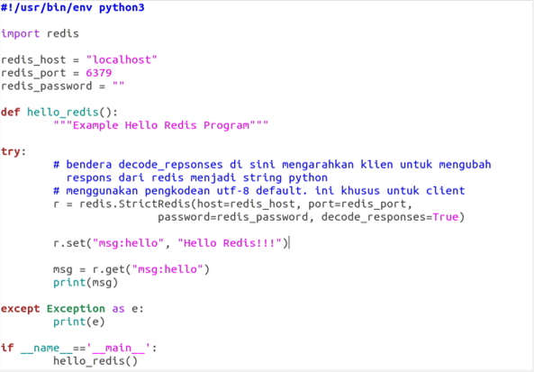

Setelah user menyalin kode ke dokumen dan mengubah parameter koneksi di langkah 2 untuk terhubung ke instance Redis user sendiri, user dapat menjalankan skrip ini langsung dari shell Unix. Jika parameter koneksi ditentukan dengan benar, maka akan menampilkan output pesan Hello Redis!!! .
Dari kode ini, user dapat memodifikasi kode tersebut menggunakan metode set dan get untuk menggunggah data yang berbeda. Dari program ini kita dapat bereksperimen dengan beberapa tipe data redis lain yang ditautkan diatas.

