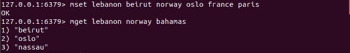
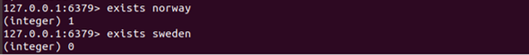

# Tugas (Kerjakan sesuai dengan artikel dari [RealPython.com](https://realpython.com/python-redis/#using-redis-py-redis-in-python))

Pada tugas dimulai dengan contoh database pemetaan negara dengan menggunakan set untuk mengatur pasangan nilai kunci dengan redis.

Urutan pernyataan yang sesuai dalam Python akan terlihat seperti ini :

Redis juga memungkinkan Anda untuk mengatur dan mendapatkan beberapa pasangan nilai kunci dalam satu perintah, MSET dan MGET:

Untuk menggunakan Python adalah dengan dict.update() :

Kami menggunakan .get () daripada .__ getitem __ () untuk meniru perilaku Redis untuk mengembalikan nilai seperti null ketika tidak ada kunci yang ditemukan. Sebagai contoh ketiga, perintah EXISTS yaitu memeriksa apakah ada kunci pada database:

Python memiliki kata kunci in untuk menguji hal yang sama, yang rute ke dict.__contains__(key):

Beberapa contoh ini dimaksudkan untuk menunjukkan, menggunakan Python asli, apa yang terjadi pada tingkat tinggi dengan beberapa perintah Redis yang umum. Tidak ada komponen client-server di sini untuk contoh Python, dan redis-py belum memasukkan gambar. Ini hanya dimaksudkan untuk menunjukkan fungsionalitas Redis dengan contoh.

