Pada pertemuan 6, user menggunakan software sistem operasi linux.

# Latihan (Install Apache Cassandra hinggal bisa dijalankan server dan cqlsh)

Pada Pertemuan 5 ini kita akan mempelajari NoSql menggunakan Apache Cassandra. Disini software yang saya gunakan yakni sistem operasi windows 10, untuk JDK yang digunakan yaitu OpenJDK 8 LTS dengan JVM Hotspot, kemudian untuk python digunakan versi 2.7.17 dan Apache Cassandra digunakan versi 3.11.6. 

Pertama-tama disini saya menginstal OpenJDK yang telah saya download pada link github praktikum atau bisa diakses di link ini [OpenJDK](https://adoptopenjdk.net/). Langkah penginstalan bisa diikuti seperti pada gambar dibawah ini. Pertama saat program sudah selesai didownload, open file instalasi OpenJDK kemudian klik next.

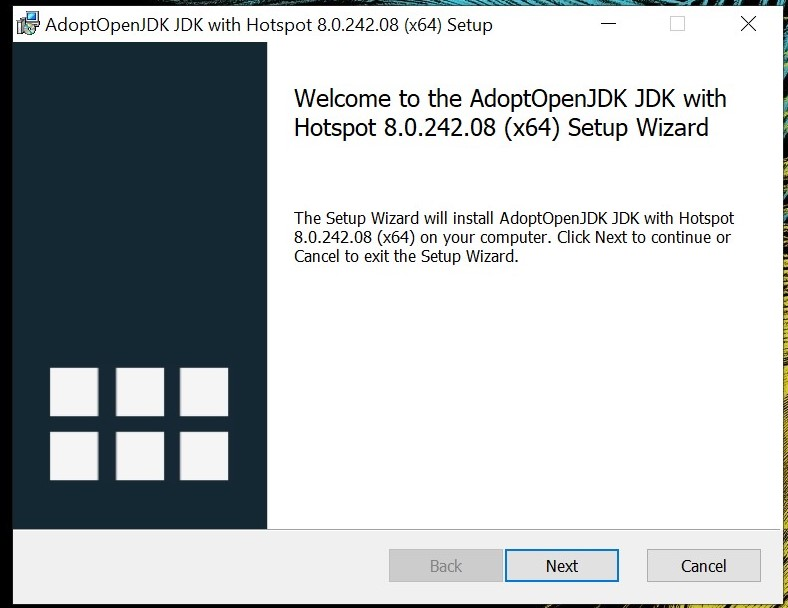

Pada bagian END-USER LICENSE AGREEENT klik checkbox/centang pada I accept the terms in the license Agreement.

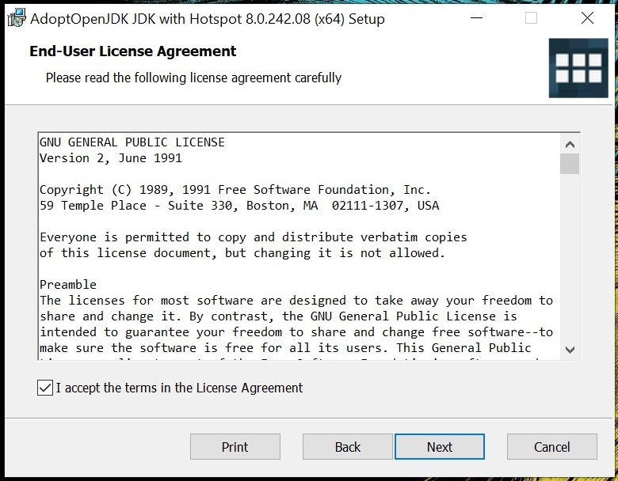

Selanjutnya, pada tab CUSTOM SETUP kita menentukan simpanan directori yang akan disimpan saat diinstalasi. Jika sudah klik tombol next.

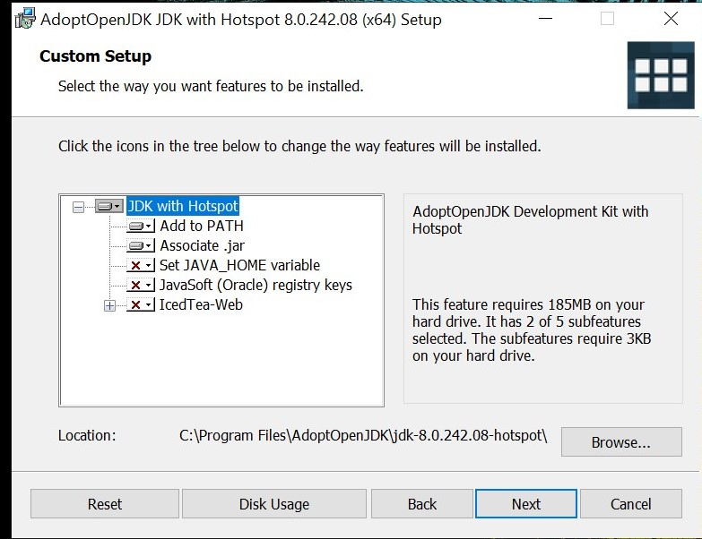

Klik install untuk melanjutkannya.

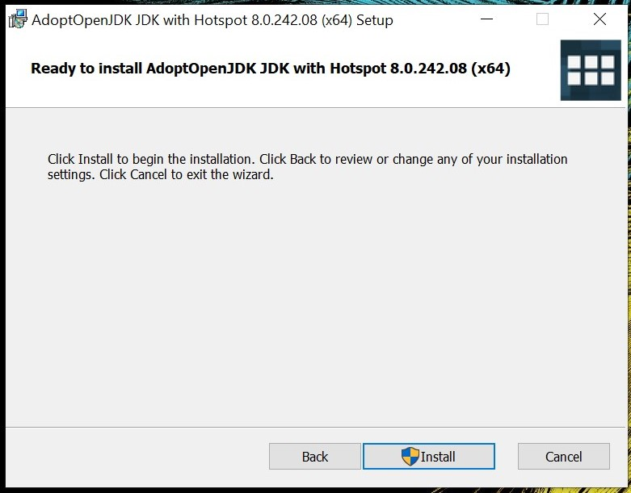

Tunggu hingga proses penginstalan selesai lalu klik Finish. Proses untuk penginstalasi OpenJDK telah berhasil.

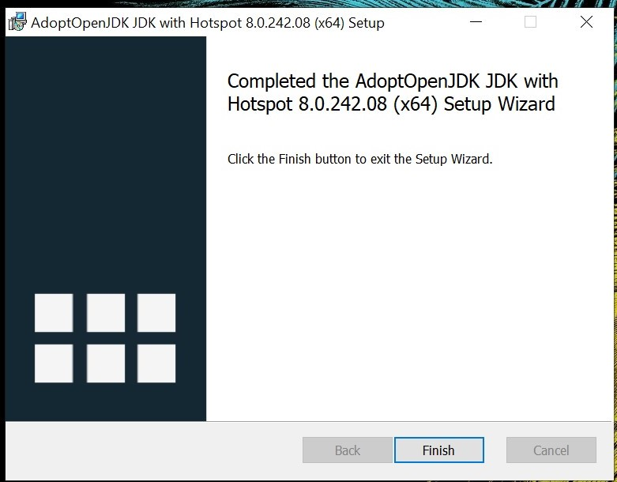

Untuk memastikan apakah program java OpenJDK sudah terinstall apa belum, disini saya membuka Command promp dan masuk ke direktori diana OpenJDK terinstall lalu mengecek dengan java.exe -version.

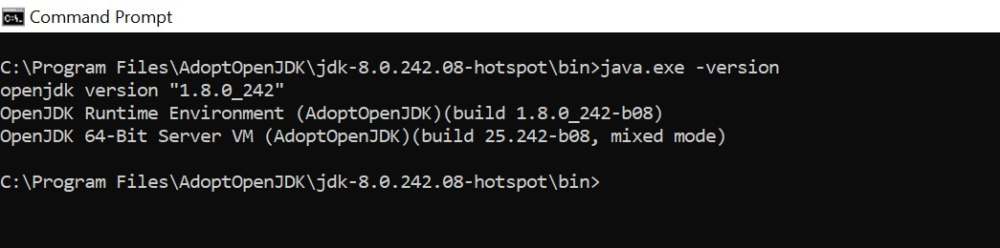

Setelah OpenJDK terinstall, kemudian dilanjuti dengan membuat user variabel path pada program java. Dengan cara klik menu search kemudian ketik Environment pada Control panel dan akan menampilkan tab Environment variables.

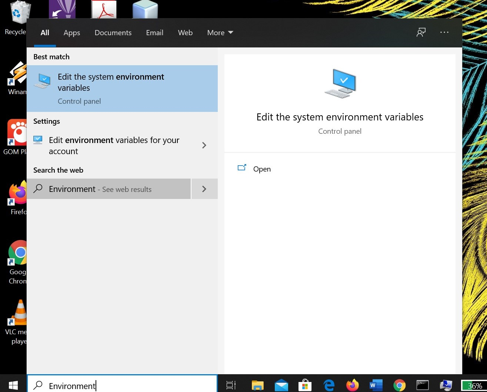

Pada System variables, klik tombol New. Kemudian tampil layar New System Variables Di kotak teks Variable name, ketikkan Java_Home, klik tombol Browse Directory…, muncul layar Browse For Folder. Arahkan ke folder C:\Program Files\AdoptOpenJDK\jdk-8.0.242.08-hotspot\bin. klik tombol OK Pada layar New System Variable di kotak teks Variable value telah berisi teks sesuai dengan folder yang telah dipilih sebelumnya. Selanjutnya klik tombol OK. Pada layar Environmental Variables, klik tombol OK. Pada layar System Properties, klik tombol OK

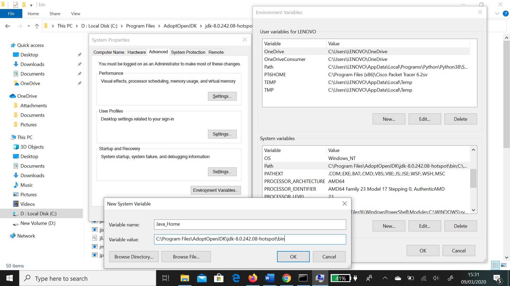

Langkah berikutnya user menginstall python. Apabila file sudah didownload, jalankan untuk installasi file python-2.7.17.amd64. msi yang sudah diunduh untuk melakukan instalasi. Ikuti petunjuk apa adanya dimana user menginstall untuk semua user.

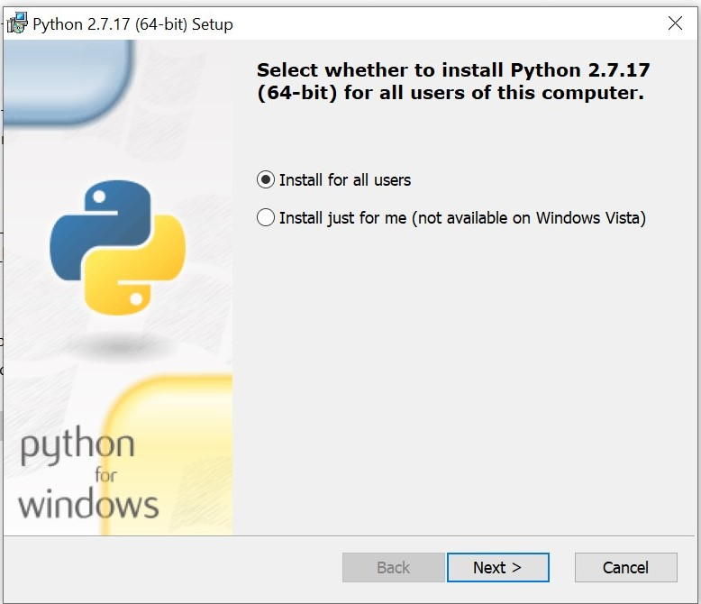

Pada menu CUSTOMIZE PYTHON user memilih Will be installed on local hard drive, selanjutnya ikuti petunjuk apa adanya sampai proses instalasi selesai.

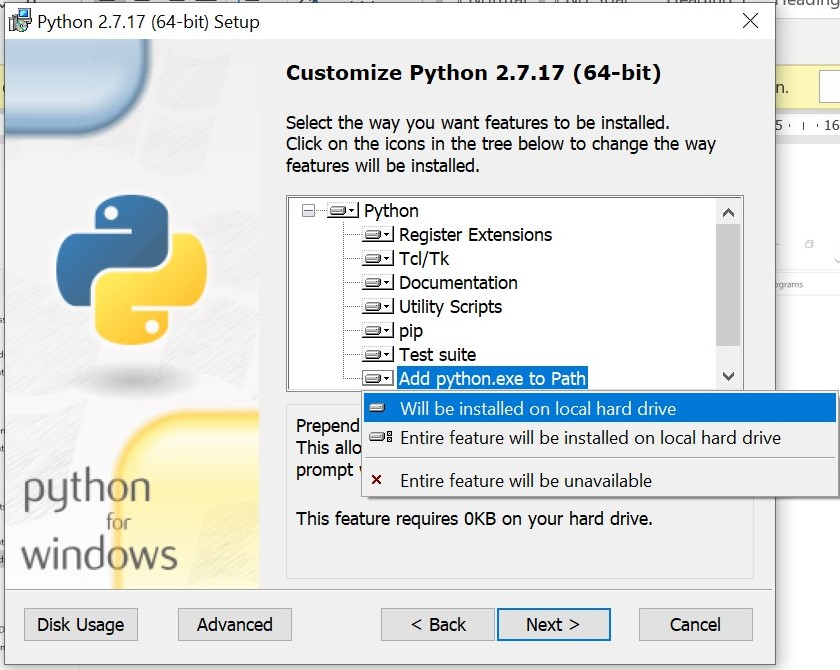

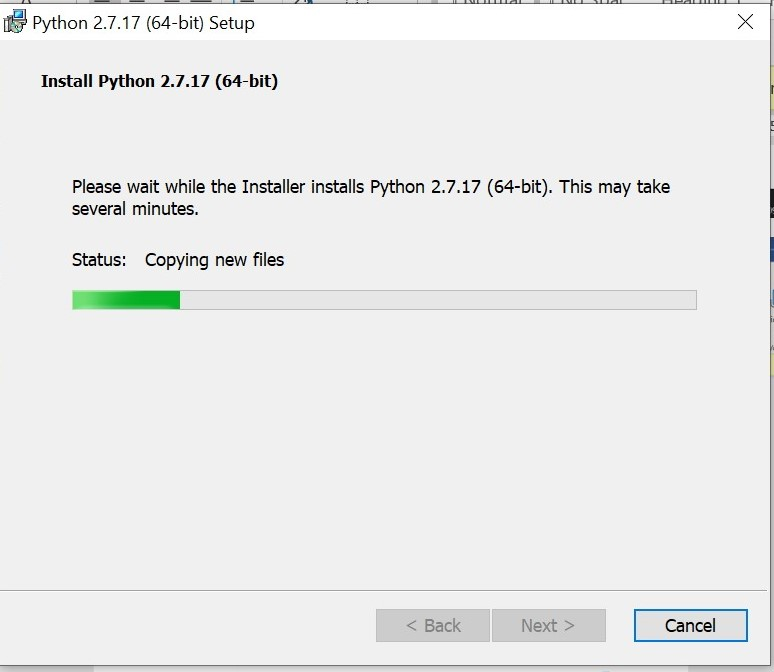

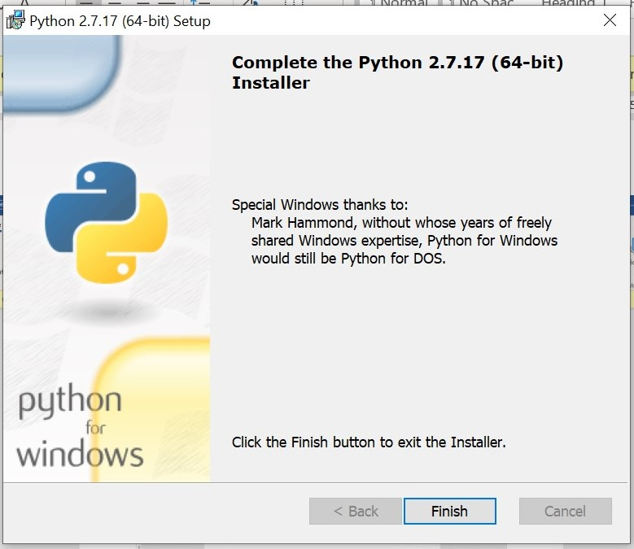

Langkah ketiga user mendownload Apache Cassandra versi 3.11.6, setelah selesai didownload, unzip dan tempatkan pada direktori “C:\Program Files\apache-cassandra-3.11.6-bin”.

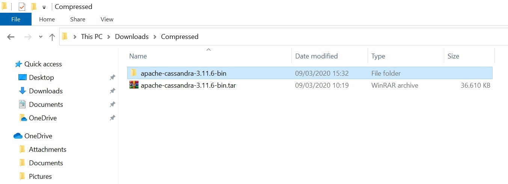

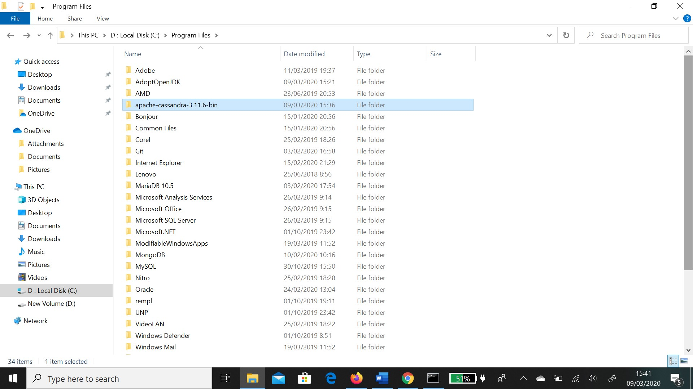

Jika sudah dipindahkan di direktori yang ditentukan, dibuka Command promp dan masuk ke directori yang ditentukan kemudian ketik Cassandra yang hasilnya seperti ditunjukkan di bawah ini.

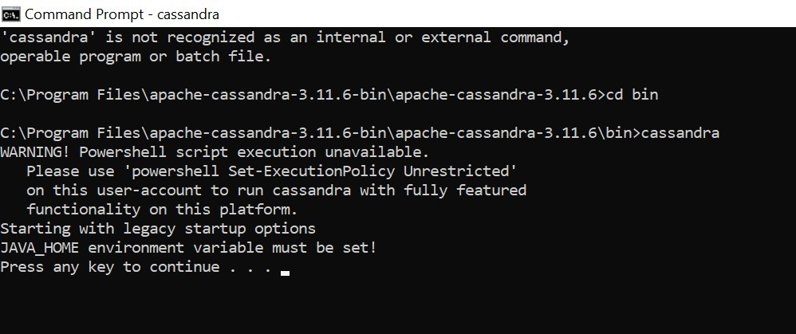

Jika mendapatkan kesalahan di atas maka Edit “cassandra.bat” menggunakan notepad tambahkan sebagai Java_Home, Simpan cassandra.bat. kemudian jalankan "cassandra.bat -f" dengan CMD Run sebagai Administrator. Kali ini, kesalahan akan teratasi jika hasil edit Anda berhasil.

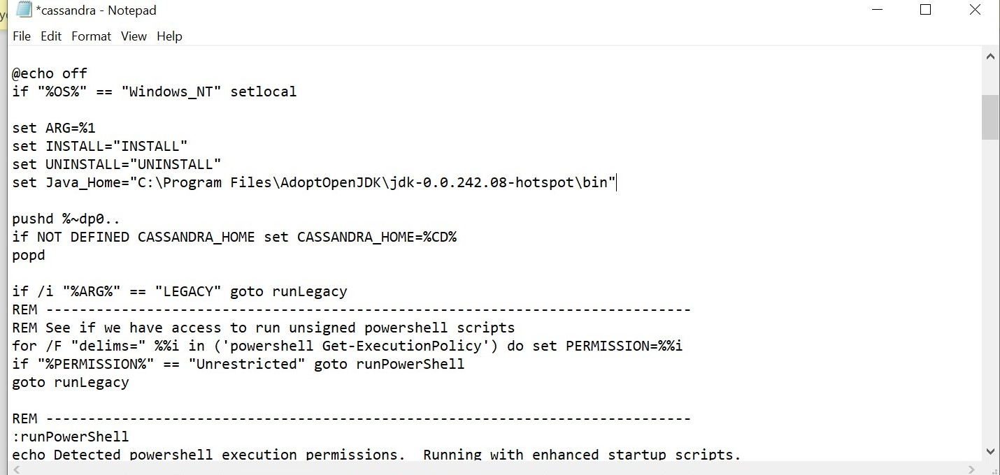

Memulai shell CQL (Cassandra Query Language)

Cassandra Query Language (CQL) adalah bahasa utama untuk berkomunikasi dengan basis data Cassandra. Cara paling dasar untuk berinteraksi dengan Cassandra adalah menggunakan shell CQL yaitu cqlsh. Anda dapat membuat basis data dan tabel, menambah data baru, mencari, mengubah dan menghapus data yang ada. dan masih banyak lagi yang lain.

Berikut cara memulai shell CQL (Cassandra Query Language), berlaku baik untuk Powershell maupun Command Prompt. Untuk memulai shell CQL, ketikkan cqlsh, tekan [Enter]

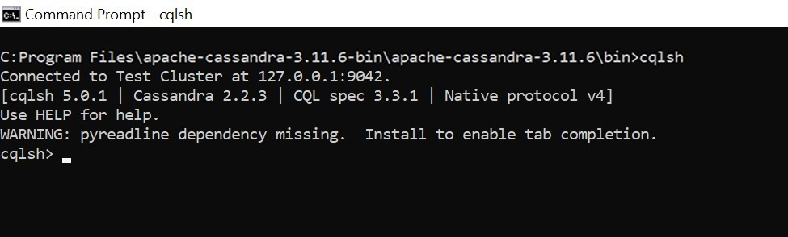

Shell siap menerima perintah CQL (Cassandra Query Language). Misalnya, dengan mengetikkan help akan tampil layar berikut.

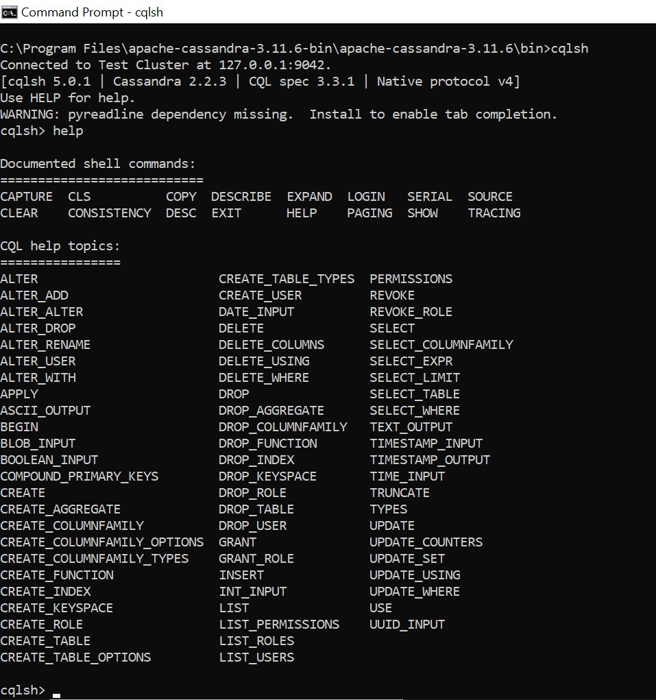

Mari kita coba membuat tabel di dalamnya. Pertama-tama buat namespace tempat data disimpan.

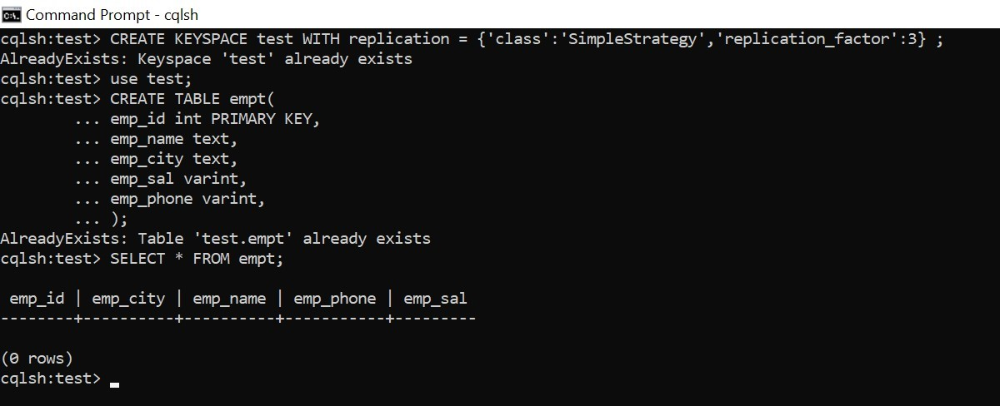

