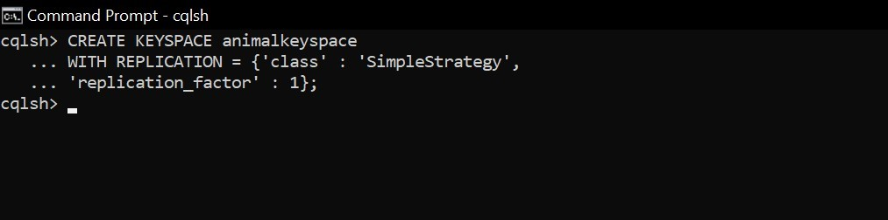
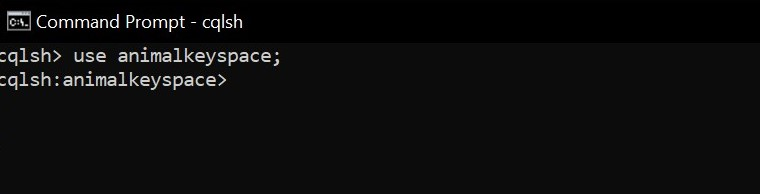
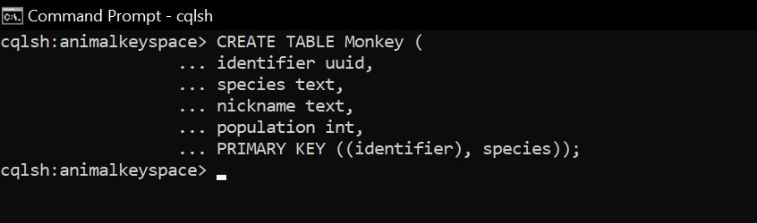
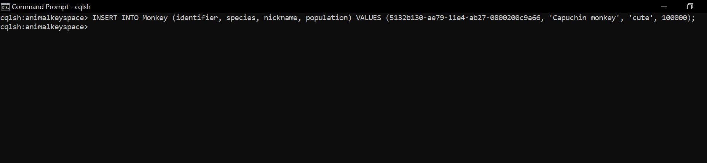
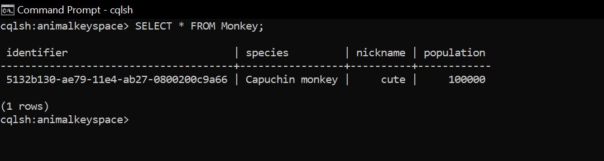
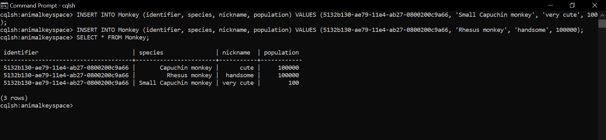

# Tugas (Kerjakan sesuai dengan artikel dari [A Practical Introduction to Cassandra Query Language](http://abiasforaction.net/a-practical-introduction-to-cassandra-query-language/)

Ditugas ini kita mulai dengan membuat keyspace. Seperti yang disebutkan sebelumnya, keyspace mirip dengan skema / basis data di dunia RDBMS. Untuk membuat keyspace, jalankan CQL berikut. Perhatikan bagian “WITH REPLICATION” dari perintah. Ini menyatakan bahwa keyspace hewan harus menggunakan strategi replication sederhana dan hanya akan memiliki satu replication untuk semua data yang dimasukkan ke dalam keyspace. Ini bagus untuk tujuan demonstrasi tetapi bukan pilihan praktis untuk segala jenis pengujian produksi.

Selanjutnya mari kita membuat kolom. Untuk membuat kolom, Anda harus menavigasi ke ruang kunci animal dengan bantuan "perintah USE". Perintah USE memungkinkan klien untuk terhubung ke keyspace tertentu sehingga semua perintah CQL lebih lanjut akan dieksekusi dalam konteks keyspace yang dipilih. Jalankan perintah berikut di prompt cqlsh Anda untuk menghubungkan klien Anda saat ini ke animalkeyspace. Perhatikan Anda prompt cqlsh akan berubah dari hanya "cqlsh>" ke "cqlsh: animalkeyspace>" yang secara visual akan mengingatkan Anda tentang keyspace Anda saat ini terhubung.

Sekarang mari kita buat tabel untuk menampung data dengan nama monkey. Untuk mendefinisikan tabel, kita harus menggunakan perintah CREATE TABLE. Harap perhatikan primary key. Kunci utama terdiri dari dua bagian. yaitu partition / row key dan cluster key. Kolom pertama dari primary key adalah partition key. Kolom yang tersisa digunakan untuk menentukan cluster key. Partition Key komposit, partition key yang terdiri dari beberapa kolom, dapat didefinisikan dengan menggunakan seperangkat tanda kurung tambahan sebelum kolom pengelompokan. Row key membantu mendistribusikan data di seluruh cluster sementara cluster key menentukan urutan data yang disimpan dalam satu baris. Jadi ketika mendesain tabel pikirkan key baris sebagai alat yang digunakan untuk menyebarkan data secara merata di seluruh cluster, sedangkan cluster key membantu menentukan urutan data tersebut di dalam baris. Patters kueri akan sangat mempengaruhi cluster key karena digunakan untuk mengurutkan data yang disimpan dalam satu baris. Perhatikan bahwa cluster key adalah opsional.

Dalam tabel di dibawah kami telah memilih identifier sebagai partition key dan spesies sebagai cluster key.

Mari kita masukkan baris ke dalam kolom di atas menggunakan pernyataan insert berikut :

Sekarang mari kita periksa file data. Ini akan memungkinkan kita untuk memiliki pemahaman yang lebih baik tentang bagaimana data sebenarnya disimpan dalam disk. Untuk mulai memiliki titik perbandingan mari kita jalankan perintah Select sederhana. Anda akan melihat output yang mirip dengan tangkapan layar berikut.

Sekarang mari kita masukkan dua baris CQL lagi. Baris pertama yang dimasukkan akan memiliki partition key yang sama tetapi akan mengubah cluster key. Baris kedua yang dimasukkan akan memiliki partition dan cluster key baru. Kemudian menampilkan tabel.

Perhatikan bahwa pernyataan penyisipan kedua hanya ditambahkan ke kunci baris yang ada dengan kunci cluster baru. Dengan demikian tiga kolom baru dengan tombol Monyet Capuchin Kecil :, Monyet Capuchin Kecil: nama panggilan dan monyet Capuchin Kecil: populasi ditambahkan ke baris 5132b130ae7911e4ab270800200c9a66. Pernyataan sisipan ketiga membuat baris baru dengan kunci pration / row 7132b130ae7911e4ab270800200c9a66.
