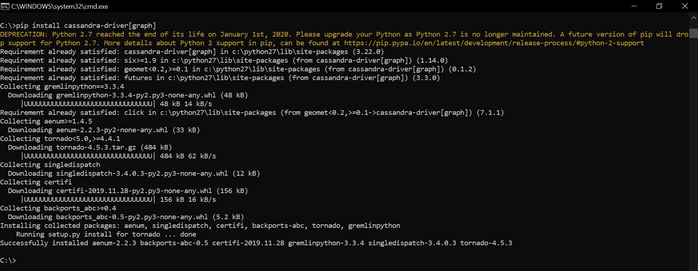
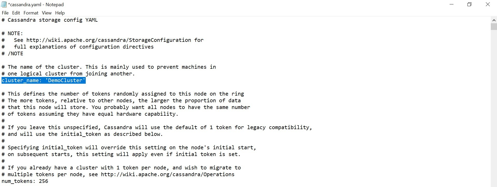

Pada pertemuan 7, user menggunakan software sistem operasi windows.

# Latihan 1 (Install driver Apache Cassandra untuk Python)

Langkah pertama adalah kita menginstall driver Cassandra yang nanti digunakan pada python. Buka aplikasi command prompt di windows. Lalu isi dengan pip install Cassandra-driver. Tunggu beberapa saat untuk mendownload file pada library package.

Kemudian kita mengupdate pip dengan cara python -m pip install –upgrade pip. Hasilnya versi pip yang tadi 19.2.3 berhasil terupgrade ke versi 20.0.2.

Selanjutnya kita menginstall driver Cassandra dalam bentuk graph, dimana Agar dapat membangun lintas GREMLIN. Dengan cara : dengan pip install Cassandra-driver[graph]. 

Kemudian kita menginstall lz4 dan scales(opsional) yang fungsinya dapat meng-Kompresi secara opsional agar digunakan untuk komunikasi antara python dan Cassandra. Jika tersedia untuk python dan Cassandra juga mendukungnya, itu akan digunakan secara otomatis. bisa dilakukan dengan cara: pip install lz4 (lz4), pip install scales.

# Konfigurasi Cassandra cluster pada windows

Mengkonfigurasi pada Cassandra.yaml pada C:\apache-cassandra-3.11.4\conf.

Selanjutnya, kita akan melakukan konfigurasi pada Cassandra.yaml dengan mengubah beberapa perintah pada file Cassandra.yaml tersebut. Pada cluster_name:’DemoCluster’ dan pada bagian seed kita isi dengan ip localhost nya seperti : - seeds: "127.0.0.1, 127.0.0.2". Begitupun untuk listen_address dan rpc_address juga kita isi dengan ip localhost. Lalu, save file Cassandra.yaml. 
Atau bisa di pelajari pada link configurasi berikut : [Cassandra cluster on windows](https://manthapavankumar.wordpress.com/2015/06/20/configuring-multi-node-cassandra-cluster-on-windows-machine/)

_________________________________________________________

_________________________________________________________

_________________________________________________________

# Latihan 2 (Kerjakan [getting started](https://docs.datastax.com/en/developer/python-driver/3.21/getting_started/))

Dibagian ini, kita membuka aplikasi Cassandra menggunakan command prompt kemudian, masuk ke dalam direktori Cassandra yang berada di C:\Program Files\DataStax Community\apache-cassandra\conf. Lalu, isi dengan cqlsh. Kemudian, kita membuat keyspace/database bernama mykeyspace. Dengan  cara :

create keyspace mykeyspace with replication={‘class’:’SimpleStrategy’,’replication_factor’:3}; pilih keyspace dengan use mykeyspace;

Berikutnya, kita membuka command prompt baru untuk mengkases python dengan cara isi python, yang kemudian sudah terakses lalu isi dengan source code seperti dibawah

>> from Cassandra.cluster import Cluster

>> cluster=Cluster()

>> cluster=Cluster([‘127.0.0.1’,’127.0.0.2’], port=9042)

>> session=cluster.connect(‘mykeyspace’)

Disini kita melakukan akses database Cassandra melalui python dengan menghubungkan cluster melalui ip localhost(172.0.0.1). Jika sudah terhubung bisa seperti gambar dibawah

Kemudian, Kita beralih ke Cassandra dengan membuat table users dengan field name, age, dan email yang kemudian email sebagai primary key. Dan kita menginput data untuk menambahkan data dengan cara :

>>insert into users (name,age,email) values (‘latifzulfikar’,19,’latifzulfikar0@gmail.com’);

>>insert into users (name,age,email) values (‘NururriAji’,20,’ajimaruf15@gmail.com’);

Selanjutnya, kita mencetak hasil dari value tabel yang sudah ditambahkan pada tabel di cmd Cassandra. Lalu kita akan menampilkan data tabel tersebut menggunakan cmd python.

>> rows=session.execute(‘SELECT name,age,email FROM users’) 

>>For row in rows:

>>Print row[0], row[1], row[2]

Maka menghasilkan data yang kita input tadi pada Cassandra. Fungsi session.excute adalah mengekeskusi query yang nanti dijalankan di Cassandra. 

