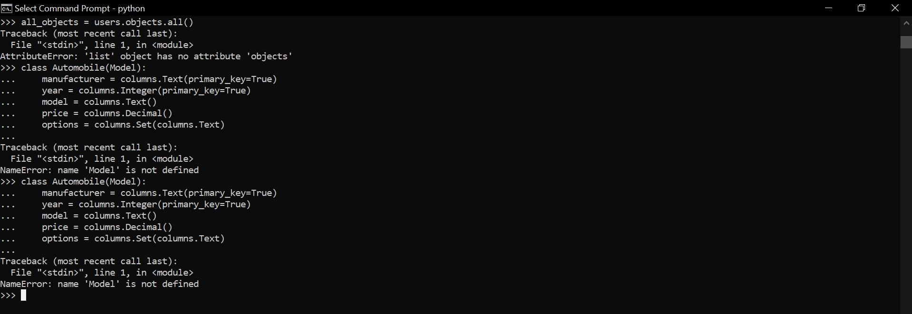

# Tugas (Kerjakan cqlengine pada [Making Queries](https://docs.datastax.com/en/developer/python-driver/3.21/cqlengine/queryset/).)

Pada tugas bagian making queries, Setelah mengisi Cassandra dengan data, disini kita akan mengambilnya. Ini dilakukan dengan objek QuerySet. Bagian ini akan menjelaskan cara menggunakan objek QuerySet untuk mengambil data yang dicari.

Namun, dibagian ini terjadi kesalahan/error dikarenakan objek dengan nama model dan person tidak terdefinisikan.

