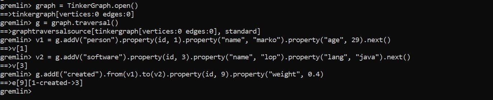
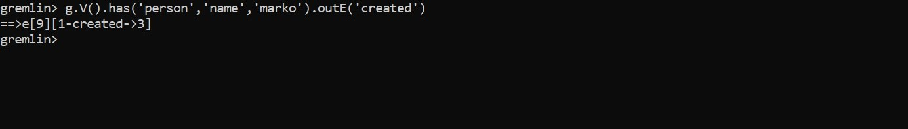
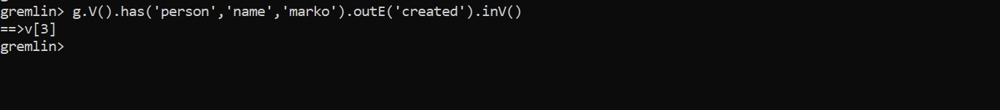
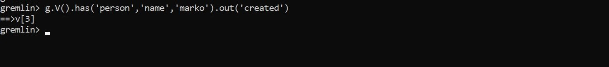
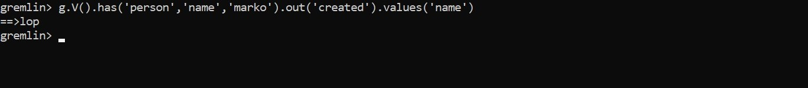
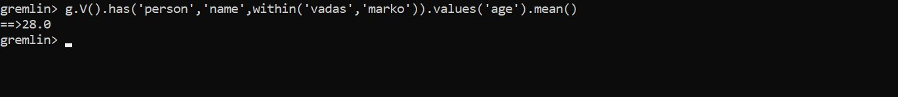
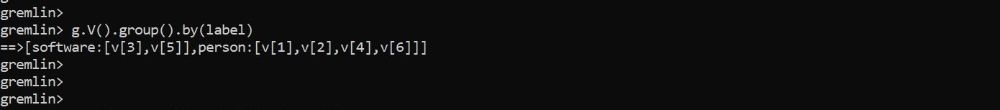

Pada pertemuan 8, user menggunakan software sistem operasi windows.

# Latihan 1 (Download Apache Tinkerpop, ambil Gremlin Server serta Gremlin Console)

Pada latihan yang pertama kita mendownload Apache Tinkerpop yang di ambil dari Gremlin Server serta Gremlin Console yang akses di [Dokumentasi Apache TinkerPop](https://tinkerpop.apache.org/) pada penjelasan dan materi di pertemuan 8.

Untuk mendownload klik kotak Gremlin console, maka akan muncul halaman web baru seperti gambar dibawah lalu klik link atau site yang telah ditandai dengan kotak dibawah. Lakukan hal yang sama untuk mendownload gremlin server.

# Latihan 2 (Kerjakan dan pahami Getting Started)

Sebelum melanjutkan ke tahap latihan getting started, pastikan kita sudah menginstal JDK sesuai dengan versinya dimana sesuai yang diminta yakni JDK 8 - minimal 1.8.0_45, versi sebelum 1.8.0_45 tidak didukung Apache TinkerPop. Disini user sudah pernah menginstall sebelumnya, user hanya perlu mengecek di command promp seperti pada gambar dibawah ini. 

Disini versi JDK sudah sesuai yang diminta, dilanjutkan untuk masuk dan akses ke gremlin dimana masuk pada command promp dengan run administrator, kemudian masuk ke direktori dimana gremlin console disimpan. Jika sudah masuk ke direktori bin maka telusuri file dengan nama gremlin.bat. apabila tampilan sudah sama seperti gambar dibawah berarti kita sudah bisa mengakses gremlin.

Pertama-tama kita membuat sebuah instance Graph bernama graph, yang dengan demikian menyediakan referensi ke data yang ingin dilalui GREMLIN. Dimana, memiliki grafik tidak memberikan GREMLIN konteks yang cukup untuk melakukan pekerjaannya. Kita juga memerlukan sesuatu yang disebut TraversalSource, yang dihasilkan oleh perintah kedua. TraversalSource memberikan informasi tambahan kepada GREMLIN (seperti strategi traversal untuk diterapkan dan mesin traversal untuk digunakan) yang memberinya panduan tentang cara menjalankan perjalanannya di sekitar Grafik.

Ada beberapa cara untuk membuat TraversalSource. Contoh di bawah menggunakan pendekatan terbatas untuk bahasa menggunakan Java Virtual Machine (JVM). Dengan TraversalSource yang tersedia, sekarang memungkinkan untuk meminta GREMLIN untuk melintasi Grafik :
    •	Dapatkan semua simpul dalam Grafik.
    •	Dapatkan simpul dengan pengidentifikasi unik "1".
    •	Dapatkan nilai properti name pada titik dengan pengidentifikasi unik "1".
    •	Dapatkan tepi dengan label "knows" untuk titik dengan pengidentifikasi unik "1".
    •	Dapatkan nama-nama orang yang memiliki simpul dengan pengidentifikasi unik "1" "knows".
    •	Perhatikan bahwa ketika seseorang menggunakan outE (). InV () seperti yang ditunjukkan pada perintah sebelumnya, ini dapat 
        disingkat menjadi just out () (mirip dengan inE (). OutV () dan in () untuk tepi yang masuk).
    •	Dapatkan nama orang-orang vertex "1" tahu siapa yang berusia di atas 30.

Membuat grafik pada gremlin untuk mengembangkan traversal, seperti pada contoh dibawah. Ada beberapa hal penting yang perlu diperhatikan dalam kode tersebut. Pertama, ingat bahwa id "dicadangkan" untuk penggunaan khusus di TinkerPop. Ini adalah anggota enum, T. "key" yang disediakan untuk metode pembuatan itu diimpor secara statis ke konsol, yang memungkinkan Anda untuk mengaksesnya tanpa harus menentukan enum sendiri. Anggap id sebagai bentuk steno yang memungkinkan gaya kode lebih lancar.

Kedua, jangan lupa bahwa Anda bekerja dengan TinkerGraph, yang memungkinkan penugasan pengidentifikasi. Itu tidak terjadi pada kebanyakan basis data grafik.

Akhirnya, label untuk Edge diperlukan dan karenanya merupakan bagian dari tanda tangan metode addEdge (). Penggunaan addEdge ini menciptakan sisi yang keluar dari v1 dan ke v2 dengan label "dibuat".

Grafik sederhana pada GREMLIN yang tahu di mana data grafik berada, kita dapat memintanya untuk mengambil beberapa data dengan melakukan traversal, yang dapat di anggap sebagai menjalankan beberapa proses di atas struktur grafik. 

secara idiomatis dengan memasukkan label titik sebagai bagian dari filter untuk memastikan bahwa kunci properti "nama" mengacu pada titik "orang". Hasil yang Kita dapat menggambarkan traversal ini dalam grafik dengan GREMLIN duduk di puncak "1".

Sekarang GREMLIN telah menemukan "marko", kita dapat mempertimbangkan langkah berikutnya dalam traversal di mana kita memintanya untuk "berjalan" dan "membuat" tepi ke simpul "perangkat lunak". Seperti yang dijelaskan sebelumnya, jadi kami harus memberi tahu GREMLIN arah mana yang harus diikuti. Dalam hal ini, kami ingin dia menelusuri tepi keluar dari titik "marko". Untuk ini, kami menggunakan langkah outE.

Untuk sampai ke titik di ujung yang lain dari tepi, kita perlu memberitahu GREMLIN untuk bergerak dari tepi ke titik yang masuk dengan inV ().

Karena kita tidak meminta GREMLIN untuk melakukan apa pun dengan properti dari tepi "create", kita dapat menyederhanakan pernyataan menggunakan:

Kemudian, sekarang GREMLIN telah mencapai "perangkat lunak yang dibuat Marko", ia memiliki akses ke properti dari vertex "perangkat lunak" dan karena itu kita dapat meminta GREMLIN untuk mengekstraksi nilai properti "nama" sebagai berikut:

sekarang kita dapat melihat koneksi yang dimiliki GREMLIN ke struktur grafik dan bagaimana GREMLIN bermanuver dari simpul ke tepi dan sebagainya. Dimana kita harus menggunakan langkah ini setiap awal  konsep dasar yang dilakukan.

Sebelumnya kita telah menggunakan has () - langkah untuk memberi tahu GREMLIN bagaimana menemukan titik "marko".

Jika kita ingin bertanya kepada GREMLIN usia rata-rata "vadas" dan "marko" kita bisa menggunakan langkah mean () seperti pada coding berikut

Metode penyaringan lainnya terlihat dalam penggunaan langkah di mana kita menemukan "perangkat lunak" yang "marko" buat

kita dapat melihat bahwa "peter", "josh" dan "marko" semua bertanggung jawab untuk membuat "v [3]", yang merupakan simpul "perangkat lunak" bernama "lop".

Kita membuat dua tambahan pada traversal untuk membuatnya mengecualikan "marko" dari hasil. Pertama, kita menambahkan langkah as (). Langkah as () - sebenarnya bukan "langkah", tetapi "modulator langkah" - sesuatu yang menambahkan fitur ke langkah atau traversal. Di sini, as ('kecualikan') memberi label has () - langkah dengan nama "kecualikan" dan semua nilai yang melewati langkah itu disimpan dalam label itu untuk digunakan nanti. Dalam hal ini, simpul "marko" adalah satu-satunya simpul yang melewati titik itu, sehingga disimpan dalam "kecualikan".

Dalam contoh, kita memberitahu GREMLIN untuk beralih melalui semua simpul dan melintasi dua kali dari masing-masing. GREMLIN akan memberi label pada masing-masing simpul di jalur itu dengan "a", "b" dan "c". kemudian dapat menggunakan pilih untuk mengekstraksi isi label itu.

Penggunaan by () di sini menyediakan mekanisme untuk melakukan pengelompokan. Dalam hal ini, kita telah meminta GREMLIN untuk menggunakan label (yang, sekali lagi, merupakan impor statis otomatis dari T di konsol). Kita tidak dapat benar-benar memberi tahu banyak tentang distribusi karena hanya memiliki pengidentifikasi simpul yang unik sebagai output. 

Untuk membuatnya lebih bagus, kita meminta GREMLIN untuk memberi nilai properti "nama" dari simpul-simpul itu, dengan memasok yang lain dengan () modulator ke grup () untuk mengubah nilai.

