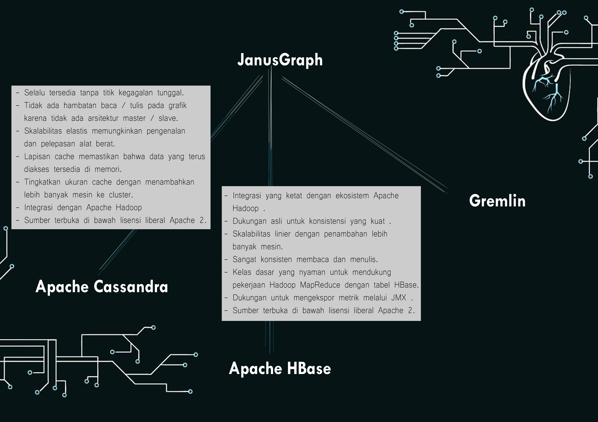

# Tugas (Kerjakan cqlengine pada [Making Queries](https://docs.datastax.com/en/developer/python-driver/3.21/cqlengine/queryset/))

Pada tugas bagian making queries, Setelah mengisi Cassandra dengan data, disini kita akan mengambilnya. Ini dilakukan dengan objek QuerySet. Bagian ini akan menjelaskan cara menggunakan objek QuerySet untuk mengambil data yang dicari.

JanusGraph adalah basis data grafik terukur yang dioptimalkan untuk menyimpan dan menanyakan grafik yang berisi ratusan miliar simpul dan tepi yang didistribusikan di seluruh multi-mesin cluster.

JanusGraph dirancang untuk mendukung pemrosesan grafik yang begitu besar sehingga mereka membutuhkan penyimpanan dan kapasitas komputasi di luar apa yang dapat disediakan oleh satu mesin. Penskalaan pemrosesan data grafik untuk lintasan real time dan pertanyaan analitis adalah manfaat mendasar JanusGraph. Bagian ini akan membahas berbagai manfaat spesifik JanusGraph dan solusi ketekunan yang mendasarinya dan didukung.

Manfaat

    •	Dukungan untuk grafik yang sangat besar. JanusGraph membuat skala grafik dengan jumlah mesin di cluster. 
    •	Dukungan untuk banyak transaksi bersamaan dan pemrosesan grafik operasional. Kapasitas transaksional JanusGraph berskala dengan 
        jumlah mesin di cluster dan menjawab pertanyaan traversal kompleks pada grafik besar dalam milidetik. 
    •	Dukungan untuk analisis grafik global dan pemrosesan grafik batch melalui kerangka kerja Hadoop. 
    •	Dukungan untuk geo, rentang numerik, dan pencarian teks lengkap untuk simpul dan tepi pada grafik yang sangat besar. 
    •	Dukungan asli untuk model data grafik properti populer yang diekspos oleh Apache TinkerPop . 
    •	Dukungan asli untuk GREMLIN traversal grafik. 
    •	Berbagai konfigurasi tingkat grafik menyediakan kenop untuk kinerja tuning. 
    •	Indeks vertex-centric menyediakan kueri level-vertex untuk mengatasi masalah dengan masalah super node yang terkenal. 
    •	Menyediakan representasi disk yang dioptimalkan untuk memungkinkan penggunaan penyimpanan dan kecepatan akses yang efisien. 
    •	Sumber terbuka di bawah lisensi liberal Apache 2 .

Diagram yang keterkaitan antara: JanusGraph, Apache Cassandra, Apache HBase, dan Gremlin.

