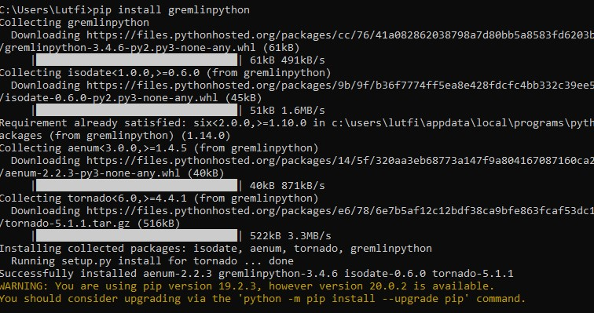

Pada pertemuan 8, user menggunakan software sistem operasi windows.

# Latihan 1 (Install driver Gremlin-Python menggunakan petunjuk pada Materi dan Penjelasan nomor 1)

Langkah pertama disini membuka command prompt. Kemudian di isi pip install gremlinpython untuk menginstall driver gremlin-python. Tunggu hingga beberapa saat untuk selesai download. Selanjutnya, membuka python dengan cara “py”.

Buka aplikasi gremlin console dengan cara buka command prompt, buka direktori tempat berada dan isi dengan gremlin.bat

Untuk menghidupkan gremlin server, masuk ke direktori tempat disimpannya dan isi dengan gremlin-server.bat

# Latihan 2 (Kerjakan dan jalankan Materi dan Penjelasan nomor 2. Jelaskan program tersebut dalam kaitannya dengan graph, vertex, edge)

Pertama, import traversal pada class gremlin python, driverremoteconnection dan json untuk javascript kemudian buat method main yang didalam nya untuk mengkoneksikan gremlin dengan python. Dibanding dengan relational database, graph database sering lebih cepat untuk himpunan data asosiatif, dan memetakan lebih langsung ke struktur aplikasi berorientasi objek (object-oriented application). Jadi keterkaitan antaran graph, vertex dan edge adalah ketiga komponen tersebut adalah termasuk ke dalam graph computer untuk membuat database berbasis grapik. 

