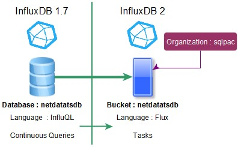
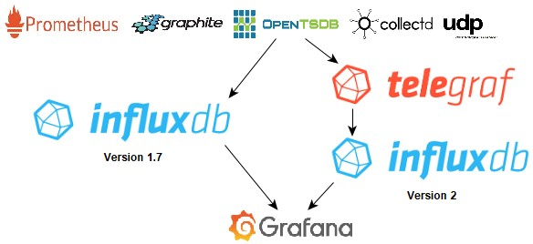

# Tugas (Carilah perbedaan antara versio 1.x.x dengan versi 2.x.x (masih versi Beta).)

Ketika Anda terbiasa dengan versi 1.x, banyak perubahan dalam versi 2. Dimana dimulai dengan Memahami, menginstal dan menggunakan basis data time series InfluxDB 1.7. Hal pertama yang perlu diketahui: basis data InfluxDB v1 sekarang merupakan bucket InfluxDB di versi 2, dan organisasi wajib terkait dengan sebuah bucket.

-   Indeks TSI adalah mesin indeks penyimpanan default, indeks In-Memory dihapus.
-   Chronograf (alat visualisasi) terintegrasi ke InfluxDB. Pilihan terbaik adalah dengan menggunakan alat visualisasi terintegrasi, Chronograf bukan lagi alat yang terpisah. Alat ini sangat intuitif. Jadi, jika perlu, kelola aturan firewall untuk membuka port 9999 dan buat pengguna dengan otorisasi yang sesuai untuk memberikan akses
- Flux adalah bahasa default dan InfluQL dihapus. Dimana yang dihasilkan dengan bahasa Flux adalah penting, tetapi setelah melewati batas mempelajari bahasa Flux, bahasa ini menawarkan fitur prosedural yang sangat menarik dan menghilangkan semua keterbatasan yang dimiliki bahasa InfluQL.
-   Kueri berkelanjutan digantikan oleh tugas dengan sintaks sedikit lebih rumit dan rentang waktu wajib, tetapi kemampuan untuk memasukkan lebih banyak logika dan menggunakan fitur bahasa Flux baru (sumber data eksternal) yang tidak mungkin dalam sintaks kueri terus menerus InfluQL.
-   Dukungan asli untuk protokol OpenTSDB, Graphite Prometheus, CollectD, UDP sayangnya juga dihapus di InfluxDB v2, agen Telegraf harus mengatur antara aplikasi dan server InfluxDB v2 untuk mengelola arsitektur ini.

Migrasi akan membutuhkan penyesuaian, banyak fungsi InfluxDB v1 diganti dalam versi 2.

