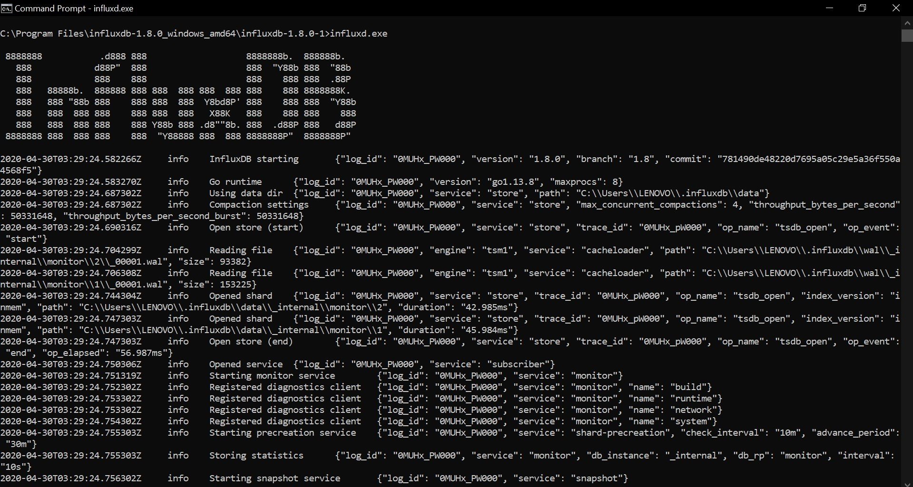
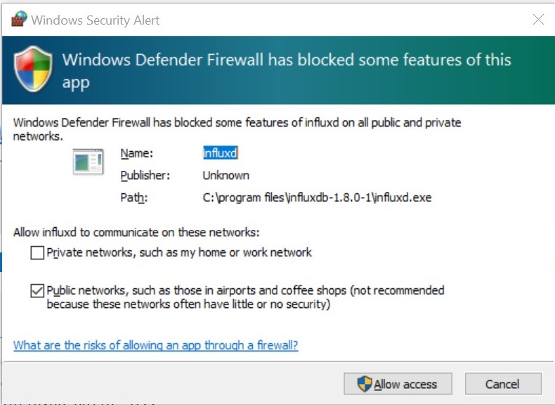
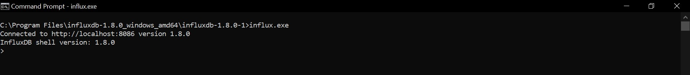
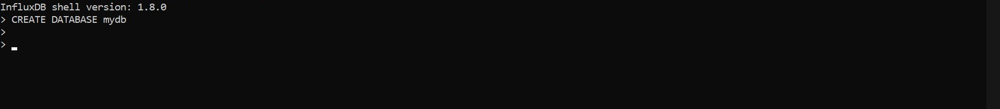
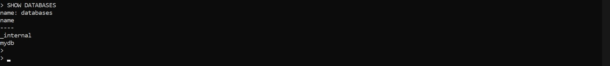
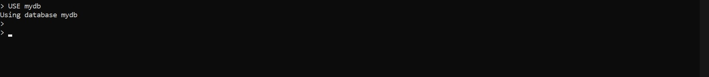
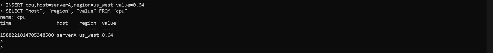
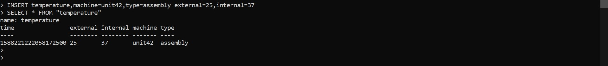
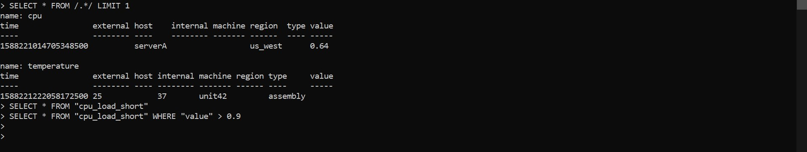

Pada pertemuan 10, user menggunakan software sistem operasi windows.

# Latihan 1 (Install InfluxDB sesuai dengan Materi dan Pembahasan point 3)

Pertama-tama menginstal InfluxDB secara lokal, perintah masuknya harus tersedia melalui baris perintah. Buka file influxd.exe pada command promp kemudian akan muncul kotak pesan berisi windows defender firewall untuk memblokir beberapa fitur influxd di semua jaringan publik atau private. Disini user mengaktifkan izinkan akses pada jaringan public, lalu klik Allow Access.

Setelah berhasil masuk ke influxd.exe, user membuka commandpromp baru dan Menjalankan influx.exe akan memulai CLI dan secara otomatis terhubung ke instance InfluxDB lokal (dengan asumsi Anda telah memulai server dengan start layanan influxdb atau dengan menjalankan influxd secara langsung). Outputnya akan terlihat seperti ini:

# Latihan 2 (Kerjakan perintah-perintah dasar di InfluxDB sesuai Materi dan Pembahasan point 4.)

Versi yang digunakan user adalah versi stabil.

Pada Latihan 2 dimulai dengan membuat database dengan pernyataan CREATE DATABASE <db-name>, di mana <db-name> adalah nama database yang ingin dibuat. Nama-nama basis data dapat berisi karakter unicode apa pun selama string tersebut dikutip ganda. Nama juga dapat dibiarkan tanda kutip jika hanya berisi huruf, digit, atau garis bawah ASCII dan tidak dimulai dengan angka. Disini user menggunakan nama database mydb 

Sekarang setelah database mydb dibuat, dilanjutkan dengan menggunakan pernyataan SHOW DATABASES untuk menampilkan semua database yang ada

Tidak seperti SHOW DATABASES, sebagian besar pernyataan InfluxQL harus beroperasi terhadap basis data tertentu. Tetapi secara eksplisit memberi nama database dengan setiap permintaan, tetapi CLI memberikan pernyataan kenyamanan, USE <db-name>, yang secara otomatis akan memilih dan mengatur database untuk semua perintah yang dijalankan. Sebagai contoh:

Untuk menyisipkan titik data seri waktu tunggal ke InfluxDB menggunakan CLI, masukkan INSERT diikuti oleh sebuah titik, dimana titik tersebut dengan nama pengukuran host dan wilayah cpu dan tag kini telah ditulis ke basis data, dengan nilai terukur 0,64. Dan kemudian menampilkan data yang disimpan pada database menggunakan perintah SELECT.

Pada INSERT kedua user mencoba menyimpan tipe data lain, dengan dua bidang dalam pengukuran yang sama. Kemudian menampilkan semua bidang dan tag dengan kueri yang menggunakan operator *.

InfluxQL memiliki banyak fitur dan kata kunci yang tidak tercakup, termasuk dukungan untuk regex Go-style. Sebagai contoh :

