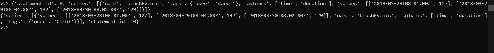

Pada pertemuan 10, user menggunakan software sistem operasi windows dan menggunakan InfluxDB versi Stabil

# Latihan 1 (Kerjakan Materi dan Penjelasan nomor 1)

Pertama-tama menginstal perpustakaan influxdb dengan menjalankan pip menggunakan argumen -m ke perintah Python, untuk memastikan Python mana yang menjadi target instal. Saat menginstal akan terlihat beberapa output yang menunjukkan keberhasilan.

Setelah berhasil menginstal, masuk ke python kemudian dilanjutkan impor InfluxDBClient dari pustaka python-influxdb untuk memastikan itu dipasang

Langkah selanjutnya adalah membuat instance baru dari InfluxDBClient (API docs), dengan informasi tentang server yang ingin di akses. Masukkan perintah berikut di REPL Anda, ganti nilai host dan port dengan URL / alamat IP dan port host InfluxDB yang sesuai. Dalam hal ini, kami berjalan secara lokal di port default

Selanjutnya, membuat database baru dengan nama ‘examplepy’ untuk menyimpan data

kemudian dapat memeriksa apakah databasenya ada dengan menggunakan fungsi get_list_database () dari clien:

Itu dia, di samping database telegraf dan _internal yang saya miliki pada instalasi saya. Akhirnya, kami akan mengatur klien untuk menggunakan basis data ini

Sekarang user melanjutkan dengan insert data, untuk memasukkan beberapa data user akan menggunakan metode write_points () clien untuk melakukannya (API docs). Metode ini mengambil daftar poin dan beberapa parameter tambahan termasuk "batch size", yang memberi kemampuan untuk memasukkan data dalam batch sebagai lawan dari semuanya sekaligus. Ini bisa bermanfaat jika Anda memasukkan data dalam jumlah besar.

Metode write_points () memiliki argumen yang disebut poin, yang merupakan daftar kamus, dan berisi poin yang akan ditulis ke database. Pertama, user menambahkan tiga poin dalam format JSON ke variabel yang disebut json_body

input default untuk write_points () adalah JSON, kita dapat memanggil metode itu menggunakan variabel json_body kita sebagai satu-satunya argument. Akan menampilkan respons True sedang dikembalikan oleh fungsi jika operasi penulisan telah berhasil.

Sekarang terdapayt beberapa data dalam basis data, mari coba menjalankan beberapa permintaan untuk mendapatkannya kembali. User akan menggunakan objek clien yang sama seperti yang di gunakan untuk menulis data, kecuali kali ini kami akan menjalankan query di InfluxDB dan mendapatkan kembali hasilnya menggunakan fungsi kueri () klien kami () (dokumen API).

Fungsi query () mengembalikan objek ResultSet (API Documents). Permintaan untuk meminta semua pengukuran dalam database sampel pyex kami, dikelompokkan berdasarkan pengguna. Anda dapat menggunakan parameter .raw untuk mengakses respons JSON mentah dari InfluxDB

